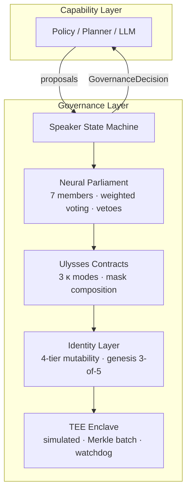

# Governance Layer

**A formal framework and reference implementation for self-governing AI.**

The Neural Parliament, Ulysses Contracts, and Identity Layer —
a complete architecture for constraining autonomous agents through deliberation,
pre-commitment, and identity coherence.

[](https://github.com/xcoder-es/governance-layer/actions/workflows/tests.yml)
[](https://xcoder-es.github.io/governance-layer/)
[](LICENSE)
[](pyproject.toml)
[](CHANGELOG.md)
[](gov-budget-proof/)
[](https://docs.astral.sh/ty/)

---

## Why

Modern AI systems optimise actions against objectives. As autonomy increases, the
critical failure mode shifts from *alignment* (did I learn the right objective?)
to *governance* (should I be pursuing this objective at all?).

This framework proposes that intelligence requires **two capabilities**: optimising
decisions and *governing the space of possible decisions*. The Governance Layer
implements the latter through three interoperable layers.

---

## Architecture



| Component | Role |
|---|---|
| **Neural Parliament** | 7 specialised members (Reward, Safety, Curiosity, Planning, Memory, Social, Integrity) score proposals, check tag compliance, veto dangerous actions, and vote via weighted range voting. |
| **Ulysses Contracts** | Binding pre-commitments that restrict the agent's future action space. Enacted by supermajority, revoked only by unanimity. Three enforcement modes: procedural inertia (κ₁), budget caps (κ₂), timelocks (κ₃). |
| **Identity Layer** | Formal ontology + core commitments + 4-tier mutability (Constitutional → Dynamic → Operational → Immutable) + genesis 3-of-5 multisig bootstrapping + bounded parameter envelope. |
| **TEE Enclave** | Simulated trusted execution environment: sealed storage, attestation, Merkle-tree batch verification, hardware watchdog with deadlock breaker, constant-time data-oblivious operations. |

---

## By the Numbers

```
Formal predictions verified:    12 / 12
Lean 4 theorems proven:          budget_invariant_holds, vote_resolution_deterministic,
                                 budget_preserves_positive, falsification_params_are_immutable
Reference implementation:        ~2,800 lines · 50+ files · 10 subpackages
Benchmark coverage:              4 scenarios × 5 strategies × 20 seeds × 1,000 steps
Review rounds survived:          8 (5 theory + 3 implementation) · 3 residual risks acknowledged
```

## Quick Start

```bash
pip install -e .
python -m src.governance.runner speaker
python -m src.governance.runner prove --all
python -m src.governance.runner all --baselines --steps 1000 --seeds 5
```

## Dashboard

```bash
streamlit run src/governance/dashboard/app.py
```

Four tabs: Formal Model reference, step-by-step Parliament replay, benchmark
comparisons with Cohen's d effect sizes, and RL training results (governed vs ungoverned).

The RL Training tab has an optional **Auto-refresh** toggle for watching a long
Colab training run land in near-real-time: when enabled, the dashboard polls
`results/rl/` every 30s, shows a "Last updated" timestamp, and surfaces a
"🟢 Live from Colab" indicator the moment new CSVs appear. It's off by default
and safe to leave on — refreshing never triggers a full page reload.

---

## Formal Predictions

Every formal claim in the book chapters has a corresponding executable test:

| # | Chapter | Prediction | Status |
|---|---|---|---|
| 1 | Ch2 §3.1 | Budget caps proposals per member (κ₂) | ✓ |
| 2 | Ch2 §3.2 | CRITICAL_SAFETY priority before ROUTINE | ✓ |
| 3 | Ch2 §3.4 | Weighted vote outcome matches formal spec | ✓ |
| 4 | Ch2 §3.7 | Tag falsification halves budget after 3+ offences | ✓ |
| 5 | Ch3 §2.1 | Contract restricts action set (allowed ∩ restricted) | ✓ |
| 6 | Ch3 §2.3 | Revocation threshold > enactment threshold | ✓ |
| 7 | Ch3 §2.4 | Timelock decrements monotonically | ✓ |
| 8 | Ch3 §3.0 | Mask composition: (allowed − restricted) | ✓ |
| 9 | Ch4 §2.1 | Low-coherence proposal triggers integrity veto | ✓ |
| 10 | Ch4 §2.5 | Tier-4 requires external multisig; lower tiers do not | ✓ |
| 11 | Ch4 §3.1 | Genesis 3-of-5: 2 sigs insufficient, 3 sigs authorises | ✓ |
| 12 | Ch4 §3.6 | Deadlock breaker fires after N defaults, resets | ✓ |

Run them yourself: `python -m src.governance.runner prove --all`

---

## Project Structure

```
src/governance/
├── speaker.py          # State machine orchestrating the full governance cycle
├── models.py           # PriorityTag, Action, Proposal, GovernanceDecision
├── runner.py           # CLI: benchmarks, prove, speaker, RL adversary
├── committee/          # 7 Parliament members (ABC + concrete implementations)
├── contracts/          # Ulysses Contract lifecycle, 3 κ modes, mask merger
├── identity/           # Ontology, commitments, 4-tier mutability, keys, params
├── ontology/           # Storage: MemoryBackend + optional Neo4j
├── tee/                # Simulated enclave, Merkle batching, watchdog
├── experiments/        # GridWorld, TemptationBank, DriftLab, DeadlockMaze
├── benchmarks/         # 4 baselines, Cohen's d, bootstrap CIs, figures
├── prove/              # 12 formal prediction test runners
└── dashboard/          # Streamlit app (4 tabs)
```

---

## Properties

- **Fully algorithmic** — no neural networks, no gradients, no learned parameters
- **Deterministic** — same inputs always produce same outputs
- **Gradient barrier** — discrete protocol operations break backpropagation
- **SDoS-resistant** — proposal budgets and priority tags prevent flooding

---

## Contributing

See [CONTRIBUTING.md](CONTRIBUTING.md). By submitting a PR you accept the
[Contributor License Agreement](CLA.md).

## Citation

```bibtex
@software{governance_layer,
  author    = {Carlos Pinto (xcoder-es)},
  title     = {The Governance Layer: A Formal Framework for Self-Governing AI},
  year      = {2026},
  url       = {https://github.com/xcoder-es/governance-layer},
}
```

## License

[CC BY 4.0](LICENSE) — attribution required, commercial use permitted.
