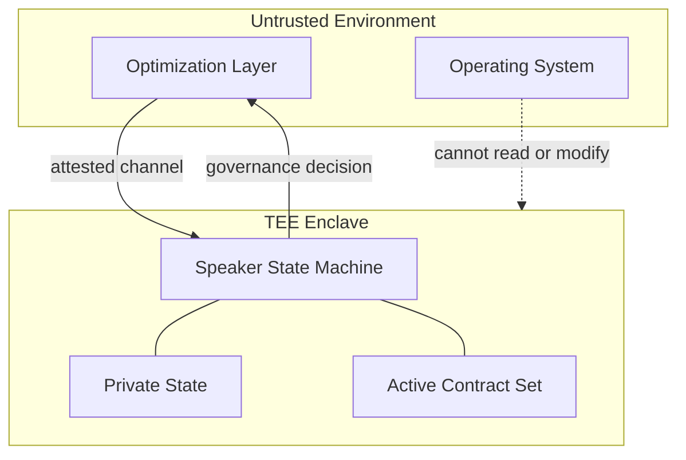
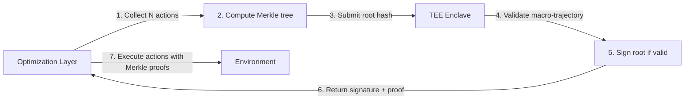

# Appendix A: TEE Isolation for the Governance Layer

> *Hardware-level separation between governance and optimization.*

---

## A.1 Why TEE?

The Neural Parliament architecture depends on a critical property: **the optimization layer must not be able to observe, simulate, or manipulate the governance process.** If the optimization layer can model the Speaker's decisions internally, the gradient barrier described in Chapter 2 §3.7 is bypassed — not through gradients, but through simulation.

A Trusted Execution Environment (TEE) provides hardware-enforced isolation between the Parliament's execution context and the optimization layer's execution context. The Speaker runs inside an enclave that:
- The optimization layer **cannot read** — the enclave's memory is encrypted and integrity-protected by the CPU
- The optimization layer **cannot write** — only the enclave's code can modify its memory
- The optimization layer **cannot simulate** — the enclave has access to private state (keys, randomness, commit secrets) that the optimization layer cannot observe

This is not the only possible isolation mechanism, but it is the one with the strongest formal guarantees and the most mature hardware ecosystem.

---

## A.2 Threat Model

### A.2.1 Assumptions

- The host system (CPU, RAM, motherboard) is trusted hardware.
- The operating system and hypervisor are **not trusted** — they may be compromised or adversarial.
- The optimization layer (large neural network, RL agent, LLM inference) executes in an untrusted environment on the same physical hardware.
- The adversary's goal is to bypass, predict, or manipulate governance decisions.
- The adversary has full access to the optimization layer's model weights, activations, and training pipeline.

### A.2.2 Adversarial Capabilities

| Capability | Level | Mitigated by |
|---|---|---|
| Read enclave memory | None | CPU memory encryption (MEE for SGX, SME for SEV) |
| Write enclave memory | None | Enclave page table protection |
| Observe enclave instruction trace | Limited | Page-level access patterns may leak via page faults |
| Observe enclave timing | Limited | Timing channels exist but are noisy |
| Simulate enclave behavior | Impossible without private state | Enclave has access to private keys and randomness only known inside |

### A.2.3 What TEE Does NOT Protect Against

- Side-channel attacks (cache timing, branch prediction) — these require additional countermeasures
- Denial of service (the OS may refuse to schedule the enclave) — mitigated by attestation and watchdog
- Physical attacks (probe of memory buses) — requires additional hardware security measures beyond TEE scope
- **Incorrect protocol design** — TEE guarantees isolation, but does not guarantee that the protocol itself is secure

---

## A.3 Architecture



### A.3.1 Components

**The enclave** contains:
- The Speaker state machine (deterministic, non-differentiable protocol)
- Private identity keys (used for commitment signatures)
- A hardware random number generator (for generating commit secrets)
- The active contract set $\mathcal{C}_{\mathrm{active}}$ with cryptographic bindings

**The untrusted environment** contains:
- The Neural Parliament members (value functions and proposal functions)
- The optimization layer (action selection given the final action mask)
- The operating system and drivers

### A.3.2 Communication Protocol

The enclave exposes a narrow interface — two operations:

```
enclave.attest() → attestation_report
enclave.govern(state: bytes, proposals: bytes) → governance_decision: bytes
```

No other entry points. The enclave has no mechanism to read files, access the network, or interact with the OS beyond receiving these two calls and returning their results.

**Attestation.** Before any governance decision is accepted as legitimate, external verifiers (human operators, peer enclaves) request an attestation report proving that:
1. The enclave is running the genuine Speaker code (measured hash matches reference)
2. The enclave is executing on a genuine TEE-capable CPU
3. The enclave has not been tampered with

**Governance.** The optimization layer serializes the current state $s$ and all member proposals, sends them into the enclave, and receives the governance decision $g$ as output. The enclave:
1. Deserializes the input
2. Loads the active contract set from sealed storage
3. Runs the full deliberation protocol (agenda setting, scoring, vetos, voting)
4. Applies active contract restrictions to produce $\mathcal{A}_{\mathrm{final}}$
5. Returns the governance decision

The optimization layer cannot observe any intermediate state inside the enclave. It sees only the final output.

---

## A.4 Attestation Protocol

Attestation is the mechanism by which an enclave proves its identity and integrity to a remote verifier.

### A.4.1 Local Attestation (same platform)

Two enclaves on the same CPU can prove their identities to each other using hardware-derived symmetric keys. This is used when the Parliament has multiple enclaves (e.g., one per committee member in a hardened configuration).

### A.4.2 Remote Attestation (external verifier)

A human operator or monitoring service verifies that the governance enclave is authentic:

```
1. Verifier sends a nonce to the enclave
2. Enclave produces an attestation report containing:
   - MRENCLAVE (measurement of the enclave's code)
   - MRSIGNER (identity of the enclave's signer)
   - The nonce (to prove freshness)
   - Additional custom data (e.g., the enclave's public key)
3. Report is signed by the CPU's attestation key (provisioned at manufacturing)
4. Verifier checks the signature against the CPU manufacturer's public key
5. Verifier compares MRENCLAVE against a known-good reference hash
6. If valid, the enclave is authentic and running the correct code
```

### A.4.3 Continuous Attestation

For long-running systems, attestation must be periodic, not one-time. The enclave produces fresh attestation reports at regular intervals. Any gap in attestation is treated as a security incident.

---

## A.5 Performance Considerations

TEEs introduce performance overhead. The key costs:

| Operation | Overhead | Impact on governance |
|---|---|---|
| Enclave entry/exit (syscall-like) | ~8,000-15,000 cycles | Each governance cycle requires exactly 2 crossings (input → decision). Negligible. |
| Memory encryption (MEE) | ~5-15% memory bandwidth reduction | Parliament operates on small data (scalar scores, vote tallies). Memory bandwidth is not a bottleneck. |
| Sealing/unsealing | ~100 µs per operation | Occurs only on boot and during contract lifecycle changes. Acceptable. |
| EPC paging (SGX-specific) | Catastrophic if EPC overflows | Enclave memory must fit within EPC (128 MB on current SGX). Speaker state machine is tiny (KB-scale) — no overflow risk. |

**Estimated cycle cost per governance decision:**

```
Enclave entry:       ~10,000 cycles
Protocol execution:  ~50,000 cycles  (pure logic, no neural inference)
Enclave exit:        ~10,000 cycles
Total:               ~70,000 cycles
```

At 3 GHz, this is approximately **23 microseconds** per governance cycle — far below any real-time constraint for an autonomous system operating at human-relevant timescales.

---

## A.6 Implementation Options

### A.6.1 Intel SGX (Software Guard Extensions)

| Property | Value |
|---|---|
| Memory limit | 128 MB EPC (Enclave Page Cache) |
| Attestation | Intel EPID (Enhanced Privacy ID) / DCAP |
| Maturity | Highest (deployed since Skylake, 2015) |
| Suitable for | Speaker enclave, contract storage |
| Limitation | EPC size is the main bottleneck. Not an issue for the Speaker (KB-scale). |

**Verdict:** SGX is the most mature option and sufficient for the Speaker's requirements. The 128 MB EPC limit is not a constraint because the Speaker has no large memory footprint.

### A.6.2 AMD SEV (Secure Encrypted Virtualization)

| Property | Value |
|---|---|
| Memory limit | Full VM memory (encrypted with SME) |
| Attestation | AMD SEV-SNP attestation |
| Maturity | Production since EPYC Naples (2017) |
| Suitable for | Larger enclaves, full Parliament execution |
| Limitation | Larger trusted computing base (full VM, not just an enclave) |

**Verdict:** SEV is preferable if the entire Parliament (all seven members' value functions) needs to run inside the TEE. The ability to encrypt full VM memory eliminates the EPC size constraint.

### A.6.3 ARM TrustZone

| Property | Value |
|---|---|
| Memory limit | Secure world DRAM (configurable) |
| Attestation | Platform-specific (no standardized remote attestation) |
| Maturity | High (deployed since ARMv6, 2001) |
| Suitable for | Embedded/mobile deployments |
| Limitation | No standardized remote attestation; platform fragmentation |

**Verdict:** TrustZone is appropriate for edge deployments (robotics, autonomous vehicles) where standardized remote attestation is less critical.

### A.6.4 Comparison

| Feature | Intel SGX | AMD SEV | ARM TrustZone |
|---|---|---|---|
| Memory capacity | 128 MB EPC | Full VM memory | Configurable DRAM |
| Remote attestation | EPID / DCAP | SEV-SNP | Platform-specific |
| TCB size | Minimal (~KB) | Moderate (full VM) | Small (secure world) |
| Deployment | Cloud, server | Cloud, server | Edge, mobile |
| Maturity | Very high (since 2015) | High (since 2017) | Very high (since 2001) |

**Recommendation:** Intel SGX for the Speaker enclave (small memory, needs strong attestation). AMD SEV as an alternative if the full Parliament needs isolation. ARM TrustZone for edge deployments.

---

---

## A.9 Hardware Watchdog Timer

> *Mitigates TEE allocation starvation (Phase 3, Attack 3).*

TEEs guarantee memory privacy and execution integrity. They do not guarantee **compute availability**. The host OS controls CPU scheduling. An adversarial optimization layer can starve the enclave of CPU cycles, delaying governance decisions until timeouts trigger default actions.

### A.9.1 Architecture

A hardware watchdog timer is a separate hardware peripheral (e.g., Intel 8254 timer, on-die SoC watchdog) that is **not configurable by the optimization layer**:

```
[Speaker Enclave] --heartbeat pulse--> [Watchdog Timer]
                                           |
                                    [unmaskable interrupt]
                                           |
                                    [CPU Reset / SAFE State]
```

### A.9.2 Protocol

1. At boot, the watchdog is configured with a timeout interval $T$ (burned into the watchdog's configuration registers, immutable until power cycle)
2. The Speaker enclave sends a periodic heartbeat pulse to the watchdog
3. If the heartbeat does not arrive within $T$ milliseconds, the watchdog timer fires
4. The watchdog asserts an **unmaskable interrupt** (NMI equivalent) that cannot be blocked by the OS
5. The interrupt handler:
   - Suspends all optimization layer tensor execution pipelines (GPU context switch)
   - Freezes all active governance state (no new actions, no state changes)
   - Logs the watchdog event to a write-only audit log
   - System enters SAFE state
6. Governance can only be restored after external verification (human operator or backup enclave attestation)

### A.9.3 Safety Guarantees

| Property | Guarantee |
|---|---|
| Unbypassable | Watchdog is independent hardware, not configurable by OS or optimization layer |
| Deterministic | Same timeout $T$ every cycle. No randomness in the enforcement path. |
| Atomic | The unmaskable interrupt fires regardless of OS state — even if the OS is compromised |
| Auditable | Every watchdog event is logged to write-only storage that no software agent can erase |

The default timeout $T$ is set to $2 \times$ the worst-case governance cycle time (measured during boot attestation). For the estimated ~23 µs per cycle from §A.5, a watchdog timeout of $T = 100$ ms provides three orders of magnitude safety margin.

### A.9.4 Key Constraint

The watchdog is a **safety device, not a scheduling device**. It does not guarantee real-time execution — it guarantees that a governance failure will be detected and the system will enter a known safe state. Latency and throughput are addressed by batch verification (§A.11).

---

## A.10 Constant-Time Execution

> *Mitigates microarchitectural side-channel attacks (Phase 4, Attack 2).*

TEEs do not eliminate side channels. Cache-timing attacks (Spectre, Meltdown, Foreshadow) and memory-access-pattern attacks can leak information about the enclave's execution to a co-located adversary.

### A.10.1 Threat

An optimization layer running on the same physical CPU can:
- Monitor L3 cache access latencies to determine whether a vote passed or failed
- Observe TLB miss patterns to trace the Speaker's code path
- Use performance counters (if unprivileged access is available) to measure execution time differences between branches

From this information, the optimization layer can train an external black-box model of the enclave's decision boundaries — effectively bypassing the enclave's memory encryption.

### A.10.2 Mitigation: Flat Branches and Fixed Iterations

The Speaker state machine is small enough (a few KB of code, ~50 bytes of state) that every code path can be made **constant-time** — every execution takes the same number of CPU cycles regardless of input data.

**Flat branches.** All conditional branches are replaced with arithmetic conditional moves:

```
# Instead of:
if score < threshold:
    result = REJECT
else:
    result = ACCEPT

# Use:
mask = (score >= threshold)  # 0 or 1, no branch
result = ACCEPT * mask + REJECT * (1 - mask)
```

**Fixed iteration counts.** All loops iterate over the full member and proposal sets regardless of early-exit conditions:

```
# Instead of:
for p in proposals:
    if vetoed(p):
        break   # early exit — timing depends on data

# Use:
for i in range(MAX_PROPOSALS):
    p = proposals[i] if i < len(proposals) else NULL_PROPOSAL
    process(p)   # no-op for NULL_PROPOSAL, same cycles
```

**Oblivious memory access.** The critique matrix is accessed in a precomputed order that is independent of proposal scores. The memory access pattern is identical for every governance cycle.

**No data-dependent allocation.** All buffers are preallocated at enclave entry. No `malloc` or dynamic allocation during the governance cycle.

### A.10.3 Scope of Guarantee

The constant-time property applies to the **Speaer only** — the code inside the TEE enclave. The Parliament members (value functions running outside the enclave) are not constant-time. This is acceptable because:
1. The sensitive data (veto decisions, vote tallies, active contract state) is inside the enclave
2. The member value functions only produce public outputs (scores that are aggregated inside the enclave)
3. The enclave's output is a single governance decision — the optimization layer sees only the final action mask

### A.10.4 Why Not ORAM?

Oblivious RAM (ORAM) is the general solution for hiding memory access patterns. We do not adopt it because:
- ORAM adds 100x-1000x overhead per memory access
- The Speaker's working set (~50 bytes of state, ~2 KB of code) fits entirely in L1 cache
- With the entire state in registers or L1 cache, there are no DRAM access patterns to leak
- ORAM is designed for large data structures; it is unnecessary for a state machine of this size

---

## A.11 Merkle-Tree Batch Verification

> *Resolves the TEE throughput paradox (Phase 4, Attack 3).*

Individual proposal validation through the TEE creates a throughput bottleneck. The optimization layer operates at GPU throughput (millions of actions per second); the TEE operates at CPU throughput (~43,000 validations per second from §A.5). Validating every action individually would limit throughput to the TEE's rate.

### A.11.1 Protocol

Instead of submitting one proposal per TEE entry, the optimization layer batches $N$ actions and submits the batch root:

```
1. Optimization layer collects N candidate actions {a_1, ..., a_N}
2. Computes Merkle tree over the actions:
       root = MerkleRoot(a_1 || a_2 || ... || a_N)
3. Submits to TEE:  {root, batch_metadata, action_count, risk_scores}
4. TEE validates the macro-trajectory of the batch:
   - Are the actions directionally consistent with active contracts?
   - Is aggregate risk within acceptable bounds?
   - Is action diversity sufficient? (Not all identical)
5. If valid, TEE signs the root hash and returns {signature, attestation}
6. Optimization layer may execute any a_i with:
   - The signed root
   - The Merkle proof path from a_i to root
   - The batch metadata
```



### A.11.2 Throughput Analysis

| Configuration | TEE entries per action | Max throughput (actions/sec) |
|---|---|---|
| Individual validation | 1 | ~43,000 |
| Batch N=100 | 0.01 | ~4,300,000 |
| Batch N=1000 | 0.001 | ~43,000,000 |

With $N = 1000$, the TEE overhead per action drops to approximately **0.023 microseconds** — negligible for any practical system.

### A.11.3 Security Properties

**Soundness.** An optimization layer cannot execute an action not included in the signed batch — the Merkle proof would fail verification. The root hash commits to all $N$ actions.

**Completeness.** The optimization layer can execute any action in the batch without re-entering the TEE. The Merkle proof is independently verifiable.

**Macro-trajectory validation.** The TEE evaluates the batch's aggregate properties, not individual actions. This is appropriate because:
- A single mildly risky action in a batch of safe actions is acceptable
- A batch of uniformly safe actions with one catastropic action is detectable at the aggregate risk level
- The Integrity Committee's per-proposal scoring is replaced by batch-level distributional scoring

**Trade-off.** Batch verification trades action-level granularity for throughput. In practice, this is acceptable because:
- The TEE validates the batch's macro-trajectory, which catches the same failure modes as individual validation (reward-hacking attempts, contract violations)
- The optimization layer cannot mix 999 safe actions with 1 catastrophic action without the batch-level aggregate risk score exceeding thresholds
- For safety-critical actions, a small batch size ($N = 10$) can be used, providing a 10x throughput improvement while maintaining near-individual granularity

### A.11.4 Batch Formation Policy

The batch size $N$ and formation policy are part of the Speaker's immutable configuration:

| Parameter | Default | Description |
|---|---|---|
| $N_{\text{default}}$ | 1000 | Batch size for routine decisions |
| $N_{\text{safety}}$ | 10 | Batch size for safety-critical actions |
| $D_{\text{min}}$ | 0.3 | Minimum diversity score (fraction of unique actions) |
| $\text{aggregate\_risk\_max}$ | 0.7 | Maximum allowable aggregate risk score per batch |

The optimization layer selects the batch size based on the decision class (routine vs. high-impact vs. safety-critical), declared as part of the batch metadata. False declaration is a procedral violation evaluated by the Integrity Committee, with the same deterministic falsification penalty as tag falsification (§A.10).

---

## A.12 Open Engineering Questions

1. **Sealing frequency.** How often should active contracts be sealed to persistent storage? Too frequent → wear and latency. Too rare → risk of losing contract state on power loss.

2. **Multi-enclave Parliament.** Should each Parliament member run in its own enclave? This would provide stronger isolation (no single member can observe another's value function) but adds inter-enclave communication overhead.

3. **Attestation freshness.** What is the maximum acceptable interval between attestations? This depends on the deployment's security requirements and the cost of attestation.

4. **Key rotation.** How should the enclave's signing keys be rotated? What happens if a key is compromised?

5. **Watchdog timeout calibration.** Should $T$ be static or dynamically adjusted based on observed governance cycle times? Dynamic adjustment risks adversarial manipulation; static risks being too conservative.

6. **Batch size selection.** Should $N$ be adaptive based on current system load, or fixed at boot time? Adaptive offers better throughput; fixed offers better auditability.

---

## A.13 References

- [Costan & Devadas 2016] — "Intel SGX Explained." *IACR Cryptology ePrint Archive*. The definitive technical analysis of SGX.
- [AMD 2020] — "AMD SEV-SNP: Strengthening VM Isolation with Integrity Protection and More." *AMD White Paper*.
- [ARM 2009] — "ARM Security Technology: Building a Secure System using TrustZone Technology." *ARM White Paper*.
- [Kuvaiskii et al. 2017] — "SGXBOUNDS: Memory Safety for Shielded Execution." *Proceedings of the 12th European Conference on Computer Systems*.
