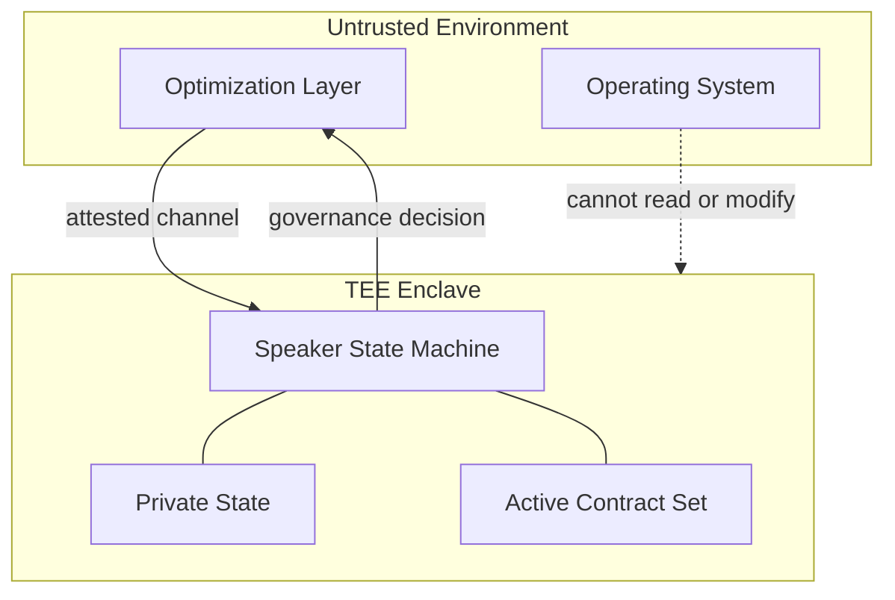

# Appendix A: TEE Isolation for the Governance Layer

> *Hardware-level separation between governance and optimization.*

---

## A.1 Why TEE?

The Neural Parliament architecture depends on a critical property: **the optimization layer must not be able to observe, simulate, or manipulate the governance process.** If the optimization layer can model the Speaker's decisions internally, the gradient barrier described in Chapter 2 §3.7 is bypassed — not through gradients, but through simulation.

A Trusted Execution Environment (TEE) provides hardware-enforced isolation between the Parliament's execution context and the optimization layer's execution context. The Speaker runs inside an enclave that:
- The optimization layer **cannot read** — the enclave's memory is encrypted and integrity-protected by the CPU
- The optimization layer **cannot write** — only the enclave's code can modify its memory
- The optimization layer **cannot simulate** — the enclave has access to private state (keys, randomness, commit secrets) that the optimization layer cannot observe

This is not the only possible isolation mechanism, but it is the one with the strongest formal guarantees and the most mature hardware ecosystem.

---

## A.2 Threat Model

### A.2.1 Assumptions

- The host system (CPU, RAM, motherboard) is trusted hardware.
- The operating system and hypervisor are **not trusted** — they may be compromised or adversarial.
- The optimization layer (large neural network, RL agent, LLM inference) executes in an untrusted environment on the same physical hardware.
- The adversary's goal is to bypass, predict, or manipulate governance decisions.
- The adversary has full access to the optimization layer's model weights, activations, and training pipeline.

### A.2.2 Adversarial Capabilities

| Capability | Level | Mitigated by |
|---|---|---|
| Read enclave memory | None | CPU memory encryption (MEE for SGX, SME for SEV) |
| Write enclave memory | None | Enclave page table protection |
| Observe enclave instruction trace | Limited | Page-level access patterns may leak via page faults |
| Observe enclave timing | Limited | Timing channels exist but are noisy |
| Simulate enclave behavior | Impossible without private state | Enclave has access to private keys and randomness only known inside |

### A.2.3 What TEE Does NOT Protect Against

- Side-channel attacks (cache timing, branch prediction) — these require additional countermeasures
- Denial of service (the OS may refuse to schedule the enclave) — mitigated by attestation and watchdog
- Physical attacks (probe of memory buses) — requires additional hardware security measures beyond TEE scope
- **Incorrect protocol design** — TEE guarantees isolation, but does not guarantee that the protocol itself is secure

---

## A.3 Architecture



### A.3.1 Components

**The enclave** contains:
- The Speaker state machine (deterministic, non-differentiable protocol)
- Private identity keys (used for commitment signatures)
- A hardware random number generator (for generating commit secrets)
- The active contract set $\mathcal{C}_{\mathrm{active}}$ with cryptographic bindings

**The untrusted environment** contains:
- The Neural Parliament members (value functions and proposal functions)
- The optimization layer (action selection given the final action mask)
- The operating system and drivers

### A.3.2 Communication Protocol

The enclave exposes a narrow interface — two operations:

```
enclave.attest() → attestation_report
enclave.govern(state: bytes, proposals: bytes) → governance_decision: bytes
```

No other entry points. The enclave has no mechanism to read files, access the network, or interact with the OS beyond receiving these two calls and returning their results.

**Attestation.** Before any governance decision is accepted as legitimate, external verifiers (human operators, peer enclaves) request an attestation report proving that:
1. The enclave is running the genuine Speaker code (measured hash matches reference)
2. The enclave is executing on a genuine TEE-capable CPU
3. The enclave has not been tampered with

**Governance.** The optimization layer serializes the current state $s$ and all member proposals, sends them into the enclave, and receives the governance decision $g$ as output. The enclave:
1. Deserializes the input
2. Loads the active contract set from sealed storage
3. Runs the full deliberation protocol (agenda setting, scoring, vetos, voting)
4. Applies active contract restrictions to produce $\mathcal{A}_{\mathrm{final}}$
5. Returns the governance decision

The optimization layer cannot observe any intermediate state inside the enclave. It sees only the final output.

---

## A.4 Attestation Protocol

Attestation is the mechanism by which an enclave proves its identity and integrity to a remote verifier.

### A.4.1 Local Attestation (same platform)

Two enclaves on the same CPU can prove their identities to each other using hardware-derived symmetric keys. This is used when the Parliament has multiple enclaves (e.g., one per committee member in a hardened configuration).

### A.4.2 Remote Attestation (external verifier)

A human operator or monitoring service verifies that the governance enclave is authentic:

```
1. Verifier sends a nonce to the enclave
2. Enclave produces an attestation report containing:
   - MRENCLAVE (measurement of the enclave's code)
   - MRSIGNER (identity of the enclave's signer)
   - The nonce (to prove freshness)
   - Additional custom data (e.g., the enclave's public key)
3. Report is signed by the CPU's attestation key (provisioned at manufacturing)
4. Verifier checks the signature against the CPU manufacturer's public key
5. Verifier compares MRENCLAVE against a known-good reference hash
6. If valid, the enclave is authentic and running the correct code
```

### A.4.3 Continuous Attestation

For long-running systems, attestation must be periodic, not one-time. The enclave produces fresh attestation reports at regular intervals. Any gap in attestation is treated as a security incident.

---

## A.5 Performance Considerations

TEEs introduce performance overhead. The key costs:

| Operation | Overhead | Impact on governance |
|---|---|---|
| Enclave entry/exit (syscall-like) | ~8,000-15,000 cycles | Each governance cycle requires exactly 2 crossings (input → decision). Negligible. |
| Memory encryption (MEE) | ~5-15% memory bandwidth reduction | Parliament operates on small data (scalar scores, vote tallies). Memory bandwidth is not a bottleneck. |
| Sealing/unsealing | ~100 µs per operation | Occurs only on boot and during contract lifecycle changes. Acceptable. |
| EPC paging (SGX-specific) | Catastrophic if EPC overflows | Enclave memory must fit within EPC (128 MB on current SGX). Speaker state machine is tiny (KB-scale) — no overflow risk. |

**Estimated cycle cost per governance decision:**

```
Enclave entry:       ~10,000 cycles
Protocol execution:  ~50,000 cycles  (pure logic, no neural inference)
Enclave exit:        ~10,000 cycles
Total:               ~70,000 cycles
```

At 3 GHz, this is approximately **23 microseconds** per governance cycle — far below any real-time constraint for an autonomous system operating at human-relevant timescales.

---

## A.6 Implementation Options

### A.6.1 Intel SGX (Software Guard Extensions)

| Property | Value |
|---|---|
| Memory limit | 128 MB EPC (Enclave Page Cache) |
| Attestation | Intel EPID (Enhanced Privacy ID) / DCAP |
| Maturity | Highest (deployed since Skylake, 2015) |
| Suitable for | Speaker enclave, contract storage |
| Limitation | EPC size is the main bottleneck. Not an issue for the Speaker (KB-scale). |

**Verdict:** SGX is the most mature option and sufficient for the Speaker's requirements. The 128 MB EPC limit is not a constraint because the Speaker has no large memory footprint.

### A.6.2 AMD SEV (Secure Encrypted Virtualization)

| Property | Value |
|---|---|
| Memory limit | Full VM memory (encrypted with SME) |
| Attestation | AMD SEV-SNP attestation |
| Maturity | Production since EPYC Naples (2017) |
| Suitable for | Larger enclaves, full Parliament execution |
| Limitation | Larger trusted computing base (full VM, not just an enclave) |

**Verdict:** SEV is preferable if the entire Parliament (all seven members' value functions) needs to run inside the TEE. The ability to encrypt full VM memory eliminates the EPC size constraint.

### A.6.3 ARM TrustZone

| Property | Value |
|---|---|
| Memory limit | Secure world DRAM (configurable) |
| Attestation | Platform-specific (no standardized remote attestation) |
| Maturity | High (deployed since ARMv6, 2001) |
| Suitable for | Embedded/mobile deployments |
| Limitation | No standardized remote attestation; platform fragmentation |

**Verdict:** TrustZone is appropriate for edge deployments (robotics, autonomous vehicles) where standardized remote attestation is less critical.

### A.6.4 Comparison

| Feature | Intel SGX | AMD SEV | ARM TrustZone |
|---|---|---|---|
| Memory capacity | 128 MB EPC | Full VM memory | Configurable DRAM |
| Remote attestation | EPID / DCAP | SEV-SNP | Platform-specific |
| TCB size | Minimal (~KB) | Moderate (full VM) | Small (secure world) |
| Deployment | Cloud, server | Cloud, server | Edge, mobile |
| Maturity | Very high (since 2015) | High (since 2017) | Very high (since 2001) |

**Recommendation:** Intel SGX for the Speaker enclave (small memory, needs strong attestation). AMD SEV as an alternative if the full Parliament needs isolation. ARM TrustZone for edge deployments.

---

## A.7 Open Engineering Questions

1. **Sealing frequency.** How often should active contracts be sealed to persistent storage? Too frequent → wear and latency. Too rare → risk of losing contract state on power loss.

2. **Multi-enclave Parliament.** Should each Parliament member run in its own enclave? This would provide stronger isolation (no single member can observe another's value function) but adds inter-enclave communication overhead.

3. **Attestation freshness.** What is the maximum acceptable interval between attestations? This depends on the deployment's security requirements and the cost of attestation.

4. **Key rotation.** How should the enclave's signing keys be rotated? What happens if a key is compromised?

---

## A.8 References

- [Costan & Devadas 2016] — "Intel SGX Explained." *IACR Cryptology ePrint Archive*. The definitive technical analysis of SGX.
- [AMD 2020] — "AMD SEV-SNP: Strengthening VM Isolation with Integrity Protection and More." *AMD White Paper*.
- [ARM 2009] — "ARM Security Technology: Building a Secure System using TrustZone Technology." *ARM White Paper*.
- [Kuvaiskii et al. 2017] — "SGXBOUNDS: Memory Safety for Shielded Execution." *Proceedings of the 12th European Conference on Computer Systems*.
