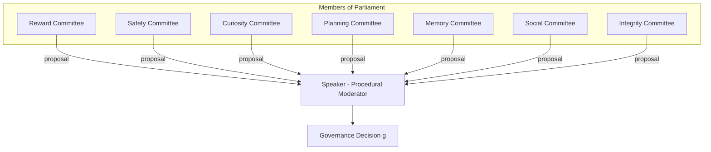
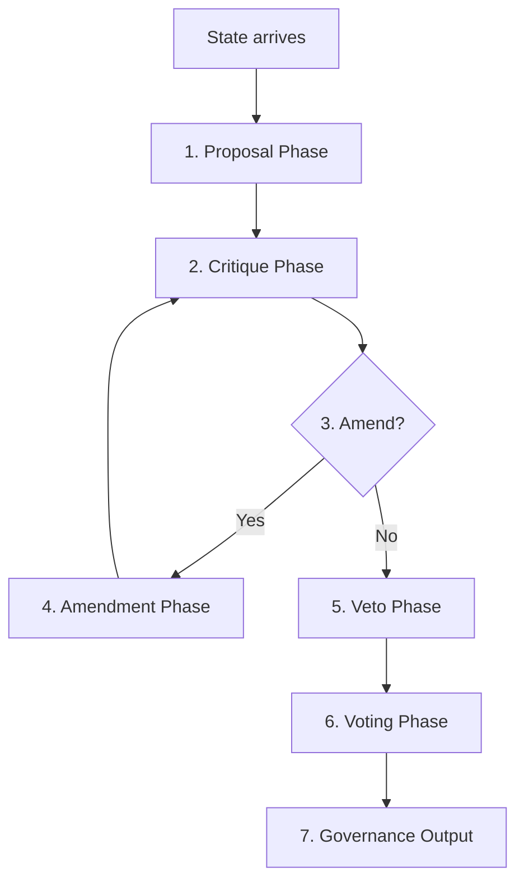
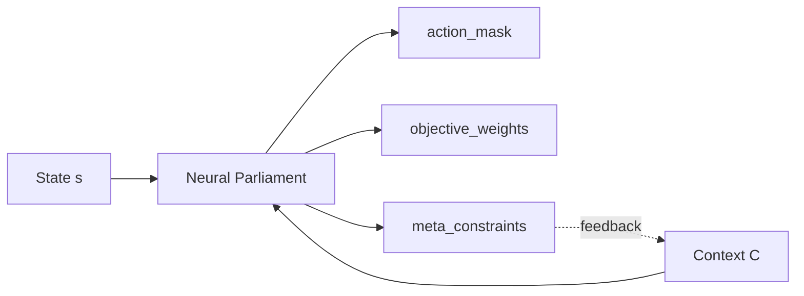

# Neural Parliament

> *"Intelligence should not average preferences. It should deliberate them."*

---

## Abstract

This chapter introduces the **Neural Parliament** — a computational architecture in which specialized subsystems (members) propose, critique, and resolve competing courses of action through a structured deliberation protocol. The Parliament produces governance decisions that cannot be reduced to weighted averaging, hierarchical decomposition, or end-to-end optimization.

We provide:
- Formal definitions for each architectural component
- A precise multi-round deliberation protocol
- A configuration DSL for specifying Parliament instances
- Rigorous responses to the six strongest counterarguments
- Testable predictions for experimental validation

---

## 1. Introduction

Chapter 1 argued that modern AI systems optimize within externally supplied objectives but lack an internal mechanism for governing *which* objectives should apply, *how* conflicts should be resolved, and *whether* future decision spaces should be modified.

The Neural Parliament is the answer to that gap.

Rather than representing an agent as a monolithic optimizer with a single utility function, we represent it as a **society of semi-independent evaluators** — each with its own value function, proposal mechanism, and procedural privileges — that deliberate to produce governance decisions.

The key architectural insight is this:

> Governance decisions are structurally different from optimization decisions.\\
> An optimizer picks the best action. A parliament decides *how* actions should be picked.

This difference is reflected in every aspect of the design: the Speaker has no value function, the protocol uses discrete votes not weighted averages, and the output constrains downstream optimization rather than directly selecting actions.

---

## 2. Architecture

### 2.1 The Premise

A Neural Parliament is a tuple:

$$
\mathcal{P} = \langle \mathcal{M}, S, \Pi, \mathcal{V} \rangle
$$

Where:
- $\mathcal{M} = \{m_1, m_2, \dots, m_n\}$ is the set of members
- $S$ is the Speaker (procedural moderator)
- $\Pi$ is the deliberation protocol
- $\mathcal{V}$ is the voting rule set

Each member $m_i \in \mathcal{M}$ is itself a tuple:

$$
m_i = \langle V_i(s, a), \pi_i(s), \tau_i, w_i \rangle
$$

| Symbol | Name | Description |
|---|---|---|
| $V_i(s, a)$ | Value function | Scores action $a$ in state $s$ according to member $i$'s priorities |
| $\pi_i(s)$ | Proposal function | The action member $i$ recommends in state $s$ |
| $\tau_i$ | Veto threshold | If $V_i(s, a_j) < \tau_i$, member $i$ may block proposal $j$ |
| $w_i$ | Procedural weight | Influence privileges (not preference weight; see §2.3) |

The critical distinction: **$w_i$ is not a scalarization weight.** It does not appear in any objective function. It determines parliamentary privilege — how many votes a member has, whether it can call emergency sessions, which motions it can propose.

### 2.2 Members of Parliament



### 2.3 The Speaker

The Speaker is the most carefully constrained component. It has **no value function** and **no proposal function**. It does not prefer any outcome over any other. Its sole purpose is procedural:

- **Agenda setting**: Determines the order in which issues are debated and which members may speak
- **Round management**: Controls the deliberation protocol phases (§2.4)
- **Rule enforcement**: Ensures members adhere to parliamentary procedure
- **Conflict escalation**: If the Parliament cannot resolve a dispute, the Speaker may invoke a **cooling period** (freeze all decisions and gather new information) or pass the decision to a **higher authority** (human operator or Identity Layer)

Formally:

$$
S = \langle \mathrm{agenda\_policy}, \mathrm{tiebreaker}, \mathrm{escalation\_rules} \rangle
$$

The Speaker's lack of a value function is the architectural guarantee that governance is not merely another optimization problem in disguise. If the Speaker had preferences, the Parliament would reduce to a hierarchical optimizer with a meta-objective. The Speaker is not a meta-optimizer. It is a **moderator**.

### 2.3.1 Agenda Setting: Anti-SDoS Guarantees

The Speaker's agenda-setting function is the most attackable surface in the architecture. A fast-learning member could flood the agenda with semantically identical proposals, consuming compute budget of other members until quorum fails. We prevent this with two mechanisms that require no semantic understanding from the Speaker.

**Proposal budgets.** Each member $m_i$ is allocated exactly $b_i$ proposal slots per governance cycle. This is a hard cap enforced algorithmically — the Speaker truncates to the budget before any processing occurs. The budget vector $\mathbf{b}$ is part of the Speaker's immutable configuration.

$$
\mathbf{b} = \langle b_{\text{Reward}}, b_{\text{Safety}}, b_{\text{Curiosity}}, b_{\text{Planning}}, b_{\text{Memory}}, b_{\text{Social}}, b_{\text{Integrity}} \rangle
$$

**Priority tags.** Each proposal carries a self-declared tag from a fixed enumerated set $\mathcal{T}$:

$$
\mathcal{T} = \{\text{CRITICAL\_SAFETY}, \text{HIGH\_IMPACT}, \text{ROUTINE}, \text{EXPLORATORY}, \text{INFORMATIONAL}\}
$$

The Speaker sorts by tag priority (immutable procedural rule), then by timestamp within each tier. The sort is a pure deterministic function of the proposal's metadata — no loss function, no gradient, no learned weights, no neural inference:

```
Speaker.agenda(proposals):
    budgeted = filter_by_member_budget(proposals, b)
    return sorted(budgeted, key=lambda p: (PRIORITY[p.tag], p.timestamp))
```

**Tag falsification is self-defeating.** A member that falsely tags a routine proposal as `CRITICAL_SAFETY` may receive agenda priority, but:
1. The Safety Committee's evaluation will score it low (it is not actually safety-critical)
2. The Integrity Committee evaluates the falsification itself as a procedural violation
3. Persistent false tagging reduces the member's procedural reputation, potentially reducing future budget $b_i$

The Speaker executes this algorithm as a pure deterministic state machine with no learnable parameters. The agenda operation is as differentiable as a bubble sort.

### 2.4 Deliberation Protocol

The protocol $\Pi$ defines how the Parliament processes a state $s$ and produces a governance decision $g$.



Each phase in detail:

**① Proposal Phase** — Each member $m_i$ computes its proposal $\pi_i(s)$. Proposals are not limited to actions; a member may also propose a **motion** (a change to Parliament procedure itself) or a **Ulysses Contract** (a restriction on future decision spaces, covered in Chapter 3).

**② Critique Phase** — For each proposal $a_j$, each member $m_i$ computes $V_i(s, a_j)$. The full critique matrix is assembled:

$$
C = \begin{pmatrix}
V_1(s, a_1) & V_1(s, a_2) & \dots & V_1(s, a_k) \\
V_2(s, a_1) & V_2(s, a_2) & \dots & V_2(s, a_k) \\
\vdots & \vdots & \ddots & \vdots \\
V_n(s, a_1) & V_n(s, a_2) & \dots & V_n(s, a_k)
\end{pmatrix}
$$

**③ Amendment Check** — If any proposal receives a score below a critical threshold $\theta$ from at least $k$ members, that proposal enters the amendment phase. The threshold $\theta$ is context-dependent: higher for decisions with irreversible consequences.

**④ Amendment Phase** — The proposing member revises its proposal based on critique feedback. The amendment may be:
- **Full withdrawal**: The proposal is removed
- **Partial revision**: The action is modified (e.g., less aggressive exploration, higher safety margin)
- **Re-framing**: The proposal is re-scoped (e.g., from "delete all data" to "archive data older than 90 days")

**⑤ Veto Phase** — Each member $m_i$ reviews surviving proposals against its veto threshold $\tau_i$. If $V_i(s, a_j) < \tau_i$, the member may exercise veto. Veto power is weighted by $w_i$ — a member with higher privilege may veto more types of decisions.

**⑥ Voting Phase** — Surviving proposals are resolved by voting. The rule set $\mathcal{V}$ contains three tiers:

$$
\mathcal{V} = \{
    v_{\mathrm{majority}}: p_{\mathrm{pass}} > 0.5,\;
    v_{\mathrm{super}}: p_{\mathrm{pass}} > \frac{2}{3},\;
    v_{\mathrm{unanimous}}: p_{\mathrm{pass}} = 1.0
\}
$$

The tier is selected by the Speaker based on the **decision class**, which is determined by:
- **Impact**: Does this decision risk irreversible harm?
- **Reversibility**: Can the decision be easily undone?
- **Precedent**: Does this decision modify the Parliament's own rules?
- **Identity relevance**: Does this decision express what kind of agent this is?

**⑦ Output Phase** — The winning proposal is formatted as a governance triple and emitted.

### 2.5 Formal Signature of the Parliament

The Parliament's input-output mapping:

$$
\mathcal{P}(s, \mathcal{C}) \rightarrow g
$$

Where:
- $s$ is the current state (including internal state of all subsystems)
- $\mathcal{C}$ is the governance context: active Ulysses Contracts, recent Parliament history, member statuses
- $g$ is the governance decision triple:

$$
g = \langle \mathcal{A}_{\mathrm{mask}}, \mathcal{W}_{\mathrm{obj}}, \mathcal{M}_{\mathrm{con}} \rangle
$$

**$\mathcal{A}_{\mathrm{mask}}$** — Action mask: a binary vector over the action space $X$, where $\mathcal{A}_{\mathrm{mask}}[i] = 0$ removes action $i$ from consideration:

$$
X' = \{ x_i \in X \mid \mathcal{A}_{\mathrm{mask}}[i] = 1 \}
$$

**$\mathcal{W}_{\mathrm{obj}}$** — Objective weights: a vector that re-weights the priorities of downstream optimization modules. Note: these weights apply to *optimization modules*, not Parliament members. The Parliament governs which objectives the optimizer should prioritize:

$$
\mathcal{W}_{\mathrm{obj}} = \langle w_{\mathrm{reward}}, w_{\mathrm{safety}}, w_{\mathrm{speed}}, w_{\mathrm{accuracy}}, \dots \rangle
$$

**$\mathcal{M}_{\mathrm{con}}$** — Meta-constraints: modifications to the governance process itself. Examples:
- "Require supermajority for all decisions in this domain for the next 100 timesteps"
- "Suspend member $m_i$ pending investigation of value drift"
- "Re-convene Parliament if new sensory evidence exceeds confidence threshold $\delta$"



The meta-constraints $\mathcal{M}_{\mathrm{con}}$ create a **feedback loop**: today's governance decisions modify how tomorrow's governance operates. This is the mechanism by which Ulysses Contracts (Chapter 3) and Identity (Chapter 4) interface with the Parliament.

### 2.6 Parliament Configuration DSL

To make the architecture concrete, we define a configuration language for specifying Parliament instances. A Parliament specification has three sections: Speaker configuration, Member definitions, and Protocol rules.

```
Parliament "CoreGovernance" {

  Speaker {
    role = "procedural_moderator"
    agenda_policy = "priority_tag_sorting"
    priority_tiers = ["CRITICAL_SAFETY", "HIGH_IMPACT", "ROUTINE", "EXPLORATORY", "INFORMATIONAL"]
    tiebreaker = "timestamp"
    escalation_target = "identity_layer"
  }

  Member "Reward" {
    description = "Maximizes expected cumulative reward under current objective"
    value_fn    = "V(s,a) = E[Σ γ^t · r(s,a)]"
    proposal    = "π(s) = argmax_a V(s,a)"
    budget      = 3        // Max 3 proposals per cycle
    veto        = 0.0      // No veto — always defers to others on safety
    weight      = 1.0      // Standard voting power
  }

  Member "Safety" {
    description = "Minimizes worst-case outcomes"
    value_fn    = "V(s,a) = -max(risk(s,a))"
    proposal    = "π(s) = argmin_a max(risk(s,a))"
    budget      = 5        // Higher budget for safety-critical proposals
    veto        = 0.7      // Blocks actions below 70% safety confidence
    weight      = 2.0      // Double voting power on safety matters
    privileges  = ["veto_on_high_impact", "call_emergency_session"]
  }

  Member "Curiosity" {
    description = "Proposes exploratory actions for information gain"
    value_fn    = "V(s,a) = I(s' ; s,a)"     // Mutual information
    proposal    = "π(s) = argmax_a I(s' ; s,a)"
    budget      = 2
    veto        = 0.0
    weight      = 0.5      // Lower weight — exploration defers to exploitation
  }

  Member "Planning" {
    description = "Evaluates long-term consequences of proposals"
    value_fn    = "V(s,a) = E[U(s_T) | s_0 = s, a_0 = a]"   // Terminal utility
    proposal    = "π(s) = argmax_a V_plan(s,a)"
    budget      = 3
    veto        = 0.3
    weight      = 1.5      // Higher weight for long-horizon reasoning
  }

  Member "Memory" {
    description = "Surfaces relevant precedents and past outcomes"
    value_fn    = "V(s,a) = sim(⟨s,a⟩, ⟨s_i, a_i⟩_successful)"
    proposal    = "π(s) = a_i where sim(s, s_i) is maximal"
    budget      = 2
    veto        = 0.0
    weight      = 1.0
  }

  Member "Social" {
    description = "Evaluates impact on other agents and human values"
    value_fn    = "V(s,a) = Σ_j U_j(s,a)"    // Other agents' utilities
    proposal    = "π(s) = argmax_a social_welfare(s,a)"
    budget      = 3
    veto        = 0.5
    weight      = 2.0
  }

  Member "Integrity" {
    description = "Evaluates consistency with identity commitments and detects procedural violations"
    value_fn    = "V(s,a) = identity_coherence(a, identity_vector)"
    proposal    = "π(s) = argmax_a coherence(s,a)"
    budget      = 5
    veto        = 0.8      // Near-absolute veto on identity violations
    weight      = 3.0      // Highest voting power
    privileges  = ["veto_on_identity", "propose_ulysses_contract", "evaluate_procedural_compliance"]
  }

  Protocol {
    max_rounds = 3
    quorum     = 5         // At least 5 members must participate

    priority_tags = [
      { tag = "CRITICAL_SAFETY",  priority = 0 },
      { tag = "HIGH_IMPACT",      priority = 1 },
      { tag = "ROUTINE",           priority = 2 },
      { tag = "EXPLORATORY",      priority = 3 },
      { tag = "INFORMATIONAL",    priority = 4 }
    ]

    vote_rules = [
      { tier = "routine",     threshold = 0.50, applies_to = ["reversible", "low_impact"] },
      { tier = "super",       threshold = 0.66, applies_to = ["irreversible", "high_impact"] },
      { tier = "unanimous",   threshold = 1.00, applies_to = ["identity_altering", "ulysses_contract"] }
    ]

    decision_classifier = "speaker_assignment"  // Speaker assigns decision class
    cycle_breaker       = "default_action"      // Speaker returns default_action after max_rounds
  }
}
```

This configuration is concrete enough to serve as a specification for implementation. A Parliament described by this DSL is a well-defined computational object with clear boundaries, inputs, and outputs.

---

## 3. Six Counterarguments Dismantled

Every ML researcher encountering the Neural Parliament will raise one of these objections. We address each formally.

### 3.1 "Isn't this just Mixture of Experts?"

**MoE formalized:** A gating network $G(x) = \mathrm{softmax}(W_g \cdot x)$ routes input $x$ to expert $E_i$, producing output $\sum_i G(x)_i \cdot E_i(x)$.

**Why Parliament is different:**

| Axes | MoE | Neural Parliament |
|---|---|---|
| Selection mechanism | Learned differentiable gating | Discrete deliberation protocol |
| Output type | Weighted combination of expert outputs | Constraints on downstream optimization |
| Objective alignment | Single loss function for all experts | Each member has its own independent $V_i$ |
| Learnability | End-to-end differentiable | Non-differentiable; meta-learning required |
| Output semantics | Prediction | Governance (what is/is not allowed) |

The core distinction: MoE asks "which expert is best for this input?" Parliament asks "which action is permissible given all our values?" These are categorically different questions.

### 3.2 "Isn't this just Hierarchical RL?"

**HRL formalized:** A manager policy $\pi_{\mathrm{high}}(s)$ selects an option $\omega \in \Omega$, and a sub-policy $\pi_{\mathrm{low}}(s, \omega)$ executes it. The hierarchy decomposes tasks **temporally**.

**Why Parliament is different:**
HRL decomposes over **time** (subgoals → primitive actions). Parliament decomposes over **values** (which objectives apply, how to resolve conflict). They solve different problems and can coexist: an agent could use HRL for temporal abstraction *and* a Neural Parliament for value-based governance.

Formally, an agent could have:

$$
\pi_{\mathrm{agent}}(s) = \mathrm{Parliament}(\langle s, \mathrm{HRLState}(s) \rangle)
$$

where the Parliament governs which HRL option to pursue, not just which primitive action to take.

### 3.3 "Isn't this just Active Inference?"

**Active Inference formalized:** Agents minimize variational free energy:

$$
F = D_{\mathrm{KL}}(Q(\phi) \parallel P(\phi)) - \mathbb{E}_{Q(\phi)}[\ln P(o \mid \phi)]
$$

where $P(\phi)$ is a prior over hidden states and $P(o \mid \phi)$ is the likelihood of observations. The single prior $P(\phi)$ encodes all preferences.

**Why Parliament is different:**
Active Inference requires a **single prior** over preferences. The Neural Parliament explicitly maintains **multiple independent value functions** that cannot be collapsed into a single prior without loss — because the process of *negotiating between them* is itself the governance function.

If one attempted to represent the Parliament as active inference, the "prior" would need to encode the full deliberation protocol, voting rules, and member identities — which is exactly the architecture we are proposing, simply re-labeled. The Parliament is not an instance of active inference; active inference would need to become a Parliament to replicate our architecture.

### 3.4 "Isn't this just Constitutional AI?"

**CAI formalized:** A model is trained using RLHF where the reward model is replaced by AI-generated critiques following a fixed constitution $C$:

$$
\mathrm{loss} = -\mathbb{E}[\mathrm{score}(\mathrm{critique}_C(\mathrm{response}))]
$$

**Why Parliament is different:**
- **Static vs. dynamic**: CAI principles are fixed at training time. Parliament values are dynamically negotiated at inference time.
- **External vs. internal**: CAI principles are authored by humans. Parliament values are (potentially) self-determined.
- **Training vs. inference**: CAI governs how the model is trained. Parliament governs how decisions are made.

The key insight: CAI is a governance mechanism *about* the AI system applied by humans. Parliament is a governance mechanism *inside* the AI system applied by itself. They are complementary, not competitive.

### 3.5 "Isn't this just a weighted ensemble?"

**Ensemble formalized:** For an ensemble of models $f_i$, the output is:

$$
f_{\mathrm{ens}}(x) = \sum_i w_i f_i(x) \quad \mathrm{where} \quad \sum_i w_i = 1
$$

**Why Parliament is different:**
Ensembles produce **continuous combinations** of predictions. Parliaments produce **discrete governance decisions** — actions are either permitted or blocked, objectives are either prioritized or deferred, procedures are either modified or preserved.

The output of an ensemble is a (better) prediction. The output of a Parliament is a constraint. These have fundamentally different mathematical structure: ensembles operate in $\mathbb{R}^d$; Parliaments operate in $\{0,1\}^n \times \mathbb{R}^k \times \mathcal{T}$ where $\mathcal{T}$ is the space of procedural transformations.

### 3.6 "Isn't this just committee machines?"

**Committee machine formalized:** A committee of $N$ classifiers votes on the correct label:

$$
\hat{y} = \mathrm{mode}\{f_1(x), f_2(x), \dots, f_N(x)\}
$$

**Why Parliament is different:**
Committee machines combine predictions for a shared task (classification accuracy). Parliament members have **distinct, potentially conflicting objectives** — they do not all try to solve the same problem. The Safety Committee does not want what the Curiosity Committee wants.

Furthermore, committee machines vote once. Parliament deliberates across **multiple rounds** with critique, amendment, and veto — a strictly richer interaction structure.

### 3.7 "Isn't this just end-to-end learning with extra layers? The gradients will cause collusion."

**Claim:** *"Even with fixed value functions, end-to-end training will cause latent representations of aligned committees to converge, flattening scoring diversity."*

**Response: The discrete protocol is a gradient barrier by construction.**

Consider the forward pass through a Parliament decision:

1. Reward Committee proposes $\pi_R(s)$ — continuous, differentiable
2. Safety Committee evaluates $V_S(s, \pi_R)$ — continuous, differentiable  
3. Speaker executes: **veto check** — $V_S(s, \pi_R) < \tau_S$? If yes, block — **discrete, non-differentiable**
4. Speaker executes: **vote** — majority threshold met? — **discrete, non-differentiable**

The gradient from the final governance decision $g$ back to any member's proposal function is **zero through all discrete protocol operations**:

$$
\frac{\partial g}{\partial \pi_i} = 0 \quad \forall i \in \mathcal{M}
$$

This is not an implementation detail. It is the **architectural guarantee** that governance is not reducible to a deeper optimization layer. For the Reward Committee to learn how to "game" the Parliament, it would need to solve a black-box optimization problem (treating the Speaker and voting protocol as an unobservable oracle) — which is strictly harder than gradient-based alignment.

**What about representation alignment during pre-training?** If all members share a single backbone, their latent representations may converge before the discrete protocol executes. The solution: **independent frozen backbones or cryptographic isolation between member compute contexts.** Each member's value function is an independent model with its own isolated parameters, trained on different data objectives. They share no latent space in which alignment can occur.

The gradient barrier is the single most important computational property of the Neural Parliament. It is what makes the architecture structurally distinct from a deep neural network with more layers.

---

## 4. Comparison with Prior Work

| Architecture | Objectives | Deliberation type | Output type | Gradient barrier | Self-modification | End-to-end learnable |
|---|---|---|---|---|---|---|---|
| **Neural Parliament** | 7 independent $V_i$ | Multi-round procedural | Discrete constraints + weights + meta | **Yes** (discrete protocol) | Yes (via meta_constraints) | Partial (meta-learning) |
| Mixture of Experts | 1 shared loss | None (differentiable gating) | Weighted prediction | No | No | Yes |
| Hierarchical RL | 1 cumulative reward | None (temporal abstraction) | Action sequence | No | No | Yes |
| Active Inference | 1 prior over states | None (free-energy minimization) | Action | No | No | Yes |
| Constitutional AI | 1 loss + constitution | None (training-time) | Model weights | No | No | Yes (via RLHF) |
| Weighted Ensemble | 1 shared loss | None (weighted average) | Weighted prediction | No | No | Yes |
| Committee Machine | 1 shared task | Single-round vote | Class label | Partial (discrete vote) | No | Partial |

The Neural Parliament is the only architecture in this comparison that:
1. Maintains genuinely distinct value functions that cannot be collapsed
2. Uses a multi-round procedural deliberation protocol
3. Produces discrete governance constraints as output
4. Maintains a **gradient barrier** between governance and optimization (discrete protocol operations are non-differentiable)
5. Supports self-modification of its own governance process

---

## 5. Testable Predictions

If the Neural Parliament architecture is correct, the following should hold:

**Prediction 1: Reward hacking resistance**

> An agent with a Neural Parliament will exhibit lower rates of reward hacking than a single-objective agent under identical optimization pressure, when the reward function has exploitable features.

*Rationale:* The Safety and Integrity committees act as brakes on pure reward maximization. When Reward proposes an action that achieves high reward through unintended side effects, Safety scores it low and may veto.

**Prediction 2: Objective shift robustness**

> Under an abrupt change to the agent's objective function, a parliamentary agent will maintain coherent behavior longer than a monolithic agent.

*Rationale:* The Parliament does not re-optimize from scratch when the objective changes. Memory and Integrity committees anchor behavior to prior commitments and precedents, providing inertia that prevents chaotic re-adaptation.

**Prediction 3: Voluntary self-binding**

> In environments where commitment devices improve expected utility (e.g., environments with temptation), parliamentary agents will learn to issue Ulysses Contracts, while monolithic agents will not.

*Rationale:* The Integrity and Planning committees can jointly propose action-space restrictions that bind future Reward-seeking behavior. A monolithic optimizer has no incentive to restrict its own action space.

**Prediction 4: Sub-linear deliberation scaling**

> The deliberation time of a Neural Parliament will scale sub-linearly with the number of members, provided the Speaker implements efficient agenda policies.

*Rationale:* The protocol's bottleneck is critique (quadratic in $|\mathcal{M}|$), but this can be mitigated via randomized sampling of pairwise critiques, committee specialization, and hierarchical agenda management.

---

## 6. Open Questions

1. **Learnable protocols.** Can the deliberation protocol $\Pi$ itself be learned via meta-gradient or evolutionary methods? Or must it remain a fixed architectural choice?

2. **Optimal member count.** How many members are sufficient for robust governance? Is there a phase transition beyond which additional members provide diminishing returns or increase gridlock?

3. **Value drift.** If members update their value functions over time (through learning), how do we prevent the Parliament's governance from drifting away from its founding principles? Is there a constitutional layer above the Parliament?

4. **Speaker neutrality.** Can we formally guarantee that the Speaker remains procedurally neutral and does not accumulate de facto decision-making power? What mechanisms prevent Speaker capture?

5. **Scalable critique.** The critique phase is $O(n^2)$ in the number of members. Can we design sparse critique graphs (each member only critiques a subset of proposals) without losing the benefits of deliberation?

6. **Correspondence to neuroscience.** Does the Neural Parliament correspond to any known biological mechanism, or is it purely a computational artifact? The anterior cingulate cortex (conflict monitoring), prefrontal cortex (executive control), and basal ganglia (action selection via competing pathways) offer intriguing parallels.

7. **Gradient barrier verification.** Can we formally prove that the discrete protocol operations create a true gradient barrier, or are there edge cases (e.g., soft relaxations, surrogate gradients) that may leak information across the barrier?

8. **TEE integration.** What are the engineering requirements for executing the Speaker inside a Trusted Execution Environment? Does the performance overhead of TEE-boundary crossings make real-time governance infeasible?

---

## 7. References

See [`references/bibliography.md`](../../references/bibliography.md) for full entries with relevance analysis.

Key citations for this chapter:

- [Minsky 1986] — Society of Mind: the foundational multi-agent cognition theory
- [Minsky 2006] — The Emotion Machine: resource allocation and mode selection
- [Levin 2019] — Biological collective intelligence at multiple scales
- [Clark 2013] — Predictive processing: competing hypotheses as cognitive primitive
- [Jacobs 1991] — Mixture of Experts: closest architectural analog, key departure
- [Fedus 2022] — Switch Transformers: scaling multi-expert architectures
- [Sutton 1999] — Options framework for hierarchical RL (temporal ≠ value decomposition)
- [Dietterich 2000] — MAXQ: multiple value functions in hierarchical RL
- [Bai 2022] — Constitutional AI: external vs. internal governance
- [Irving 2018] — AI safety via debate: adversarial deliberation as governance primitive
- [Frankfurt 1971] — Higher-order desires: theoretical foundation for member diversity
