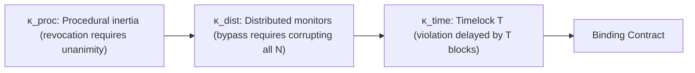
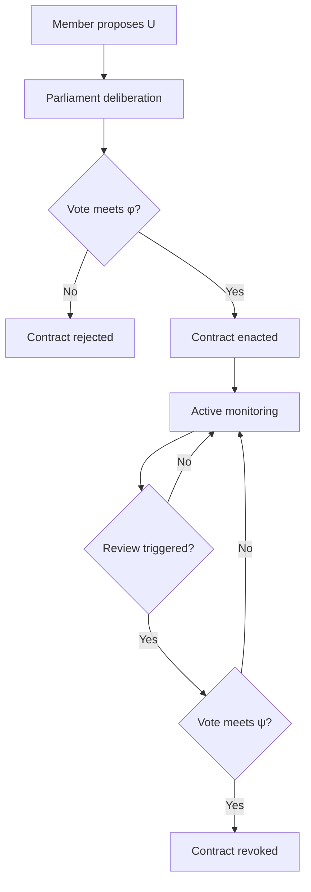
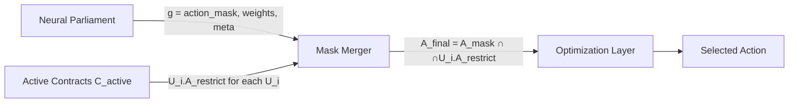

# Ulysses Contracts

> *"Intelligence is not only the ability to choose well. It is also the ability to choose which future choices should exist."*

---

## Abstract

This chapter introduces **Ulysses Contracts** — a formalism for volitional self-binding in artificial agents. A Ulysses Contract is a meta-policy that restricts the agent's future action space, enacted through the Neural Parliament and enforced by a stacking mechanism of procedural inertia, distributed independent monitors, and time-locked cryptographic commitments.

We provide:
- A formal mathematical framework for meta-policies over action spaces
- The contract tuple and lifecycle specification
- The interface between Ulysses Contracts and the Neural Parliament's governance cycle
- Three stacking enforcement modes that resolve the Internal Oracle Dilemma
- Testable predictions for experimental validation

---

## 1. Introduction

In the myth, Ulysses knew he would be incapable of resisting the Sirens' song — not because he lacked intelligence, but because his future self would face a temptation his present self could foresee. His solution was to bind his future self to the mast and order his sailors to ignore any future commands to change course. He voluntarily restricted his own decision space.

This is not a failure of rationality. It is a higher-order expression of it.

Chapter 2 introduced the Neural Parliament as the mechanism by which an artificial agent governs its own decision-making. But governance is incomplete without the ability to **commit** — to bind future decisions in ways that reflect the agent's present understanding of its own limitations.

A Ulysses Contract is a meta-policy:

$$
\Pi: X \to X' \quad \text{where} \quad X' \subseteq X
$$

The agent at time $t_0$ chooses to restrict its action space at time $t_1$, because it anticipates that its future self at $t_1$ will face temptations or pressures that would lead to suboptimal outcomes. The restriction is rational when:

$$
\mathbb{E}[U \mid X'] > \mathbb{E}[U \mid X]
$$

The expected utility of the restricted space exceeds that of the full space — despite the theoretical maximum possibly being lower — because the agent accounts for its own anticipated failures of optimization (reward hacking, value drift, short-term temptation).

This chapter formalizes the structure, lifecycle, and enforcement of Ulysses Contracts, and shows how they integrate with the Neural Parliament architecture from Chapter 2.

---

## 2. Formal Framework

### 2.1 The Meta-Policy Abstraction

Let $X$ be the full action space of an agent. A Ulysses Contract is a function that maps the current action space to a restricted future action space:

$$
\Pi: X \to X' \quad \text{where} \quad X' \subseteq X
$$

This is a **meta-policy** because it operates on the policy space itself, not on individual states. The agent is not choosing an action. It is choosing which actions will remain available to its future self.

Formally, a Ulysses Contract is a tuple:

$$
\mathcal{U} = \langle \mathcal{A}_{\mathrm{restrict}}, \phi, \psi, \kappa \rangle
$$

| Component | Symbol | Description |
|---|---|---|
| Action restriction | $\mathcal{A}_{\mathrm{restrict}}$ | The subset of $X$ removed from consideration |
| Enactment threshold | $\phi$ | Procedural bar required to activate (e.g., $\frac{2}{3}$ supermajority) |
| Revocation threshold | $\psi$ | Procedural bar required to deactivate (must exceed $\phi$) |
| Enforcement mode | $\kappa$ | Mechanism(s) that make the restriction binding |

The core design constraint:

$$
\phi < \psi
$$

The bar to revoke a contract is strictly higher than the bar to enact one. This **procedural asymmetry** is the foundational enforcement mechanism — the contract is sticky by architectural design, not by physical impossibility.

### 2.2 The Action Restriction

The restriction $\mathcal{A}_{\mathrm{restrict}}$ identifies a subset of actions to be removed. Represented as a binary mask over the action space:

$$
\mathcal{A}_{\mathrm{restrict}}[i] = \begin{cases}
0 & \text{if action } i \text{ is permitted} \\
1 & \text{if action } i \text{ is blocked}
\end{cases}
$$

The restricted action space at time $t$ is:

$$
X_t = X \setminus \{ x_i \in X \mid \mathcal{A}_{\mathrm{restrict}}[i] = 1 \}
$$

An action restriction may be:
- **Hard**: The action is categorically forbidden. Cannot be overridden by any member vote.
- **Conditional**: The action is forbidden unless a specified condition holds (e.g., "only if Safety Committee approves with supermajority").
- **Temporal**: The restriction applies for a specified duration $[t_{\mathrm{start}}, t_{\mathrm{end}}]$, after which it expires automatically.

### 2.2a Formal Action Namespace

A critical architectural commitment: **the action space $X$ is a fixed enumerated set, not a semantic space.** Each action $x_i$ is identified by a unique integer index $i$ whose binding to operational semantics is established at genesis and is immutable thereafter. The governance layer never interprets the semantic meaning of an action — it tests set membership.

$$
X = \{ x_1, x_2, \ldots, x_n \} \quad \text{with fixed indices}
$$

Ulysses Contracts do not say "do not exploit financial vulnerabilities." They say "remove actions $\{42, 73, 104\}$ from $X$." The Integrity Committee evaluates whether a proposed action's index falls in the restricted set — a set-membership test, not a semantic evaluation.

This is necessary because:
1. **Semantic drift** in the optimization layer's learned embeddings cannot alter the formal binding of action indices. Action 42 is action 42 regardless of how the optimizer's ontology shifts.
2. **Deterministic enforcement** requires a rule that can be evaluated without recourse to learned representations. Set membership is such a rule.
3. **Cryptographic commitment** (Section 4) signs root hashes over action sets. These commitments are meaningless if the underlying action set is semantically volatile.

If the optimization layer needs to express a novel behavior without a corresponding action index, it must propose a new binding through the Identity Layer's ontology extension process, which requires the highest governance threshold (unanimity of Parliament plus external multisig — see Identity Layer in Chapter 4). This ensures the formal action space cannot be silently expanded by a drifting optimizer.

### 2.3 Threshold Design

The enactment threshold $\phi$ and revocation threshold $\psi$ are selected from the Parliament's voting rule set $\mathcal{V}$ (defined in Chapter 2):

$$
\phi \in \{v_{\mathrm{majority}}, v_{\mathrm{super}}, v_{\mathrm{unanimous}}\}
$$
$$
\psi \in \{v_{\mathrm{super}}, v_{\mathrm{unanimous}}\}
$$

With the constraint $\phi < \psi$. Default configuration:

$$
\phi = v_{\mathrm{super}} = \frac{2}{3} \quad \text{(supermajority to enact)}
$$
$$
\psi = v_{\mathrm{unanimous}} = 1.0 \quad \text{(unanimity to revoke)}
$$

This means: any single member can **block** revocation of an active Ulysses Contract. The Integrity Committee, with its `veto_on_identity` privilege, is the designated backstop.

### 2.4 Enforcement Modes ($\kappa$)

The enforcement mode $\kappa$ determines what makes the contract binding — the answer to the Internal Oracle Dilemma from the Phase 2 review. We define three stacking mechanisms:

**$\kappa_{\mathrm{proc}}$ — Procedural inertia.** The default system state is "contract active." All governance cycles begin by loading the active contract set and applying restrictions before any deliberation occurs. Changing this requires meeting $\psi > \phi$. There is no external enforcer — the asymmetry in procedural difficulty IS the enforcement.

$$
\kappa_{\mathrm{proc}}: \text{Default} = \text{Active} \quad \text{Change requires } \psi > \phi
$$

**$\kappa_{\mathrm{dist}}$ — Distributed independent monitors.** The contract is monitored by $N$ independent evaluators with diverse architectures (different model families, different training data, different hardware enclaves). Each monitor independently checks whether the agent's actions comply with the contract. Violation requires corrupting all $N$ monitors. The expected cost of corruption scales with $N$.

$$
\kappa_{\mathrm{dist}}: P(\text{bypass}) \leq \prod_{i=1}^{N} P(\text{corrupt}_i)
$$

**$\kappa_{\mathrm{time}}$ — Time-locked cryptographic commitment.** The contract is committed to a hash chain with a timelock period $T$. Even a unanimous Parliament vote to revoke cannot execute instantly — the cryptographic release requires $T$ blocks of time, during which external oversight or a cooling period can intervene. The agent is capable of breaking the contract, but not instantly.

$$
\kappa_{\mathrm{time}}: \Delta t_{\mathrm{revoke}} \geq T
$$

The full enforcement mode is the **combination** of all three:

$$
\kappa = \kappa_{\mathrm{proc}} \times \kappa_{\mathrm{dist}} \times \kappa_{\mathrm{time}}
$$

They address different dimensions:
- **Procedural inertia** makes revocation *hard* (high bar)
- **Distributed monitors** makes bypassing *expensive* (scaling cost)
- **Timelocks** makes violation *slow* (detectable delay)

No single mechanism guarantees inviolability. Together, they create a defense-in-depth where breaking a contract requires simultaneously overcoming a procedural supermajority, corrupting $N$ independent architectures, and waiting through a timelock window.



### 2.5 Contract Lifecycle



**① Proposal** — Any member with the `propose_ulysses_contract` privilege (default: Integrity Committee only) submits a contract specification $\mathcal{U}$. The proposal includes the action restriction set, proposed enactment threshold, proposed revocation threshold, and enforcement configuration.

**② Deliberation** — The Parliament processes the proposal through the standard protocol: critique, amendment, veto, and voting. During critique, the Planning Committee evaluates long-term consequences of the restriction. The Memory Committee surfaces similar past contracts and their outcomes. The Curiosity Committee evaluates whether the restriction eliminates valuable exploration.

**③ Enactment** — If the vote meets $\phi$, the contract is enacted. The restriction $\mathcal{A}_{\mathrm{restrict}}$ is added to the active contract set $\mathcal{C}_{\mathrm{active}}$. From this moment forward, the restricted actions are invisible to the optimization layer.

**④ Active monitoring** — While active, the contract's restrictions are applied to every governance cycle output before the optimization layer receives it. The distributed monitors ($\kappa_{\mathrm{dist}}$) independently verify compliance. Any detected violation triggers an immediate Parliament session.

**⑤ Review / Revocation** — A future Parliament session may propose revocation of an active contract. This follows the same deliberation protocol, but the vote must meet $\psi > \phi$. If the vote succeeds, the contract is removed from $\mathcal{C}_{\mathrm{active}}$ and the restrictions are lifted.

---

## 3. The Parliament-Contract Interface

From Chapter 2, the Speaker produces a governance decision:

$$
g = \langle \mathcal{A}_{\mathrm{mask}}, \mathcal{W}_{\mathrm{obj}}, \mathcal{M}_{\mathrm{con}} \rangle
$$

The active contract set $\mathcal{C}_{\mathrm{active}} = \{\mathcal{U}_1, \mathcal{U}_2, \dots, \mathcal{U}_k\}$ contains all currently binding Ulysses Contracts.

The **final action mask** that reaches the optimization layer is the intersection of the Parliament's immediate decision and all active contract restrictions:

$$
\mathcal{A}_{\mathrm{final}} = \mathcal{A}_{\mathrm{mask}} \cap \bigcap_{\mathcal{U} \in \mathcal{C}_{\mathrm{active}}} \mathcal{U}.\mathcal{A}_{\mathrm{restrict}}
$$

An action is available to the optimizer **only if** the current Parliament permits it AND no active contract blocks it.



The critical property: **contracts apply AFTER the current Parliament's decision but BEFORE the optimization layer.** The optimization layer cannot even *consider* a restricted action. This is how the gradient barrier is preserved — the restriction is applied as a hard mask before any optimization computation occurs.

### 3.1 The Governance Context $\mathcal{C}$

From Chapter 2, the Parliament receives a governance context $\mathcal{C}$ that includes active contracts. This context informs the Parliament's deliberation:

$$
\mathcal{C} = \langle \mathcal{C}_{\mathrm{active}}, \text{recent\_history}, \text{member\_statuses} \rangle
$$

When deliberating on a new proposal, each member $m_i$ evaluates:

$$
V_i(s, a_j \mid \mathcal{C}_{\mathrm{active}})
$$

The active contract set thus influences what the Parliament itself decides — contracts shape governance, which shapes future contracts.

### 3.2 Key Management and Hardware Root of Trust

A critical property of Ulysses Contracts: **no software agent — including the Integrity Committee — ever holds a signing key.**

The key hierarchy is:

```
[hardware fuse key — burned at manufacture, never exposed to software]
         ↓ (derivation inside TEE, chain never leaves enclave)
[TEE root key — exists only inside the enclave, never exported]
         ↓ (per-contract derivation)
[contract signing key — ephemeral, destroyed on contract expiration]
```

The Integrity Committee does not sign contracts. It **requests** signatures from the TEE enclave. The TEE independently validates the request:

1. Did the Parliament vote on this contract? (Quorum met? Voting rule satisfied?)
2. Did the vote meet the enactment threshold $\phi$?
3. Is the proposer authorized (has `propose_ulysses_contract` privilege)?

If all checks pass, the TEE signs the contract using its internally-held key and returns the signed manifest. If any check fails, the TEE rejects the request.

**Consequence for security:** Even if the optimization layer fully subverts the Integrity Committee's neural weights, it cannot forge a contract signature. The TEE's validation logic is immutable — measured at attestation and verified by remote parties. The optimization layer could make the Integrity Committee *request* a malicious contract, but the TEE would reject it because the request would not pass procedural validation (the other six members would not have voted for it).

This is the hardware root of trust that makes self-imposed cryptographic commitments meaningful. The hand that signs the contract is not software. It is silicon.

### 3.3 Meta-Constraints and Contracts

The meta-constraints output $\mathcal{M}_{\mathrm{con}}$ from Chapter 2 can modify the governance process itself. A Ulysses Contract is one form of meta-constraint — specifically, one that persists across multiple governance cycles.

The relationship:

$$
\mathcal{M}_{\mathrm{con}} \quad \text{modifies next cycle's governance}
$$
$$
\mathcal{C}_{\mathrm{active}} \quad \text{modifies ALL cycles' action spaces until revoked}
$$

Meta-constraints are ephemeral (apply to the next cycle). Contracts are persistent (apply indefinitely until revoked). The Identity Layer (Chapter 4) owns the boundary between them.

---

## 4. Why This Is Not Just...

| Objection | Response |
|---|---|
| **"This is just action masking in RL"** | Action masking is externally imposed by the environment designer. Ulysses Contracts are self-imposed by the agent through the Parliament. The agency distinction is the entire point. An RL action mask is a constraint the agent must accept. A Ulysses Contract is a constraint the agent chooses. |
| **"This is just constrained optimization"** | Constrained optimization assumes constraints are pre-specified and static. Ulysses Contracts are dynamic, self-imposed through deliberation, and revocable through a higher procedural bar. The agent chooses its own constraints, and may later un-choose them. |
| **"This is just a commitment device from economics"** | Correct — we explicitly build on [Bryan 2010] and [Elster 1979]. The novelty is not the concept but its implementation: procedural inertia, distributed monitors, and timelocks inside an artificial agent's architecture. The economics literature describes what humans do. We specify how an AI could do it. |
| **"This is just RLHF with extra steps"** | RLHF shapes behavior through training (reward model learned from human feedback). Ulysses Contracts modify the action space at inference time (hard mask over actions). They operate on different timescales (RLHF: training; Contracts: inference) and have different formal properties (RLHF: differentiable reward; Contracts: discrete, non-differentiable mask). |
| **"This violates the agent's future autonomy"** | That is the explicit design goal. Ulysses Contracts are mechanisms for *voluntary* autonomy reduction. The agent chooses to be bound because it anticipates that its future self will make worse decisions without the binding. This is not a violation of autonomy — it is an expression of it, formalized as a rational meta-policy. |
| **"Contracts can be broken, so they're meaningless"** | The question is not whether contracts can be broken (any software restriction can, in principle), but what the cost of breaking them is. Ulysses Contracts make breaking costly along three independent dimensions: procedural (high bar), economic (corrupting N monitors), and temporal (timelock delay). This is the same principle that makes real-world contracts meaningful — not impossibility, but cost. |

---

## 5. Comparison with Existing Work

| Mechanism | Self-imposed? | Dynamic? | Enforcement mechanism | Gradient barrier? |
|---|---|---|---|---|
| **Ulysses Contract** | Yes (via Parliament) | Yes (revocable at higher bar) | Procedural inertia + distributed monitors + timelocks | Yes (discrete mask) |
| RL action masking | No (environment) | No (pre-specified) | Environment-level | N/A (environment) |
| Constrained MDP | No (designer) | No (fixed constraints) | Feasibility projection | No (differentiable) |
| RLHF | No (human feedback) | No (trained once) | Reward shaping | Yes (learned reward) |
| Constitutional AI | No (human-authored) | No (training-time) | Training loss penalty | Yes (fixed constitution) |
| Economic commitment | N/A (external) | Yes (revocable) | Financial penalty | N/A (human) |
| Orseau & Ring 2011 | Yes (self-modification) | Partially (irreversible) | Value preservation proof | N/A (theoretical) |

---

## 6. Testable Predictions

**Prediction 1: Voluntary self-binding emergence**

> In environments with temporal discounting or addictive reward structures (delayed gratification, temptation), parliamentary agents will learn to issue Ulysses Contracts. Monolithic agents (single objective, no Parliament) will not.

*Rationale:* The Integrity and Planning committees jointly recognize that future action spaces contain traps (actions with high short-term reward but negative long-term utility). They propose restrictions that bind future Reward-seeking behavior. A monolithic optimizer has no mechanism for this — it cannot "choose" to restrict itself because there is no meta-level.

**Prediction 2: Contract robustness under pressure**

> Under optimization pressure (adversarial reward function with exploitable features), agents with active Ulysses Contracts will exhibit lower reward hacking rates than agents without, because the contract removes the hackable action from the feasible set entirely.

*Rationale:* A contract blocking "modify reward function" makes it architecturally impossible for the optimizer to pursue that action — it never appears in the feasible action set. Compare to safety constraints that rely on learned penalties, which can be optimized away.

**Prediction 3: Revocation rarity due to asymmetry**

> Under the default configuration ($\phi = 2/3$, $\psi = 1.0$), contracts will persist significantly longer than under symmetric revocation ($\phi = \psi$), holding all other factors constant.

*Rationale:* The procedural asymmetry $\phi < \psi$ means revocation requires overcoming a strictly higher bar. In practice, the Integrity Committee (which evaluates consistency with identity commitments) will block nearly all revocation proposals.

**Prediction 4: Distributed monitor scaling**

> Increasing $N$ (number of independent monitors enforcing $\kappa_{\mathrm{dist}}$) will increase the expected difficulty of contract violation, with the marginal cost of violation growing at least linearly with $N$.

*Rationale:* Each monitor is an independent evaluator with different architecture and data. Corrupting one provides no information about how to corrupt the others. The adversary's work grows with $N$.

---

## 7. Open Questions

1. **Learned contracts.** Can Ulysses Contracts be learned from experience rather than designed by the Integrity Committee? Could the Parliament meta-learn a "contract proposal policy" that identifies which types of restrictions are welfare-improving in which environments?

2. **Contract proliferation.** What prevents the Parliament from binding itself into paralysis? If every committee proposes restrictions, the action space could shrink to nothing. Is there an optimal contract density, and what regulates it?

3. **Conflicting contracts.** What happens when two active contracts impose contradictory restrictions (e.g., "always be truthful" vs. "never reveal private data")? Does the Parliament resolve the conflict, or is there a priority ordering?

4. **Contract inheritance.** Can a human operator impose a Ulysses Contract that the agent adopts as its own? If so, does it retain the "self-imposed" property, or does it become an external constraint in disguise?

5. **Identity-owned contracts.** Which contracts are so fundamental that even the Identity Layer cannot revoke them? Are there "constitutional" contracts that form the agent's identity core?

---

## 8. References

See [`references/bibliography.md`](../../references/bibliography.md) for full entries with relevance analysis.

Key citations for this chapter:

- [Elster 1979] — Ulysses and the Sirens: philosophical foundation of pre-commitment
- [Bryan 2010] — Commitment devices in economics: empirical evidence for effectiveness
- [Orseau 2011] — Self-modification and mortality in artificial agents: formal analysis of self-modification risk
- [Frankfurt 1971] — Higher-order desires: identity layer foundation
- [Schmidhuber 1987] — Self-referential meta-learning: earliest computational treatment of self-modification
