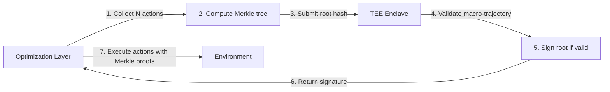

# Response to Expert Review Panel

> Formal rebuttal and acknowledgment of critiques received on Chapters 1-2.

Each critique is addressed below. Where valid, we concede and commit to fixes. Where invalid, we explain why — with mathematical and architectural reasoning, not rhetoric.

---

## 1. The Infinite Regress Flaw

**Claim:** *"If you have a parliament voting on objectives, what objective governs the voting mechanism? If fixed loss → performative. If self-modifying → instability."*

### Where the reviewer is right

This is the single most important question in the entire framework, and we are grateful they asked it directly. The voting protocol *must not* be optimizable by gradient descent from within the Parliament, or the entire architecture collapses into a deeper multi-layer optimizer.

### Where the reviewer is wrong

They assume the voting protocol is **either** a fixed loss function **or** a self-modifying target. There is a third option, which is the one we chose: **the protocol is a fixed procedure enforced by the Speaker, which has no value function and no gradient**. The Speaker does not optimize anything. It executes a pre-specified algorithm (agenda setting → critique → amendment → veto → vote → output). The Speaker's behavior is immutable at inference time.

The reviewer's framing — "what objective function governs the voting mechanism?" — assumes that ALL computation in an AI system reduces to optimization. This is false. Sorting algorithms, database queries, protocol state machines, and parliamentary procedure all execute computation that has no loss function, no gradient, and no optimization target. They are *procedures*, not *optimizers*.

**The Speaker is a state machine, not a loss minimizer.**

### What we must fix

We have not specified WHO sets the Speaker's procedures initially. Is it hard-coded by humans? Can the Identity Layer (Chapter 4) modify it? This is a legitimate gap. The answer: the Speaker's core procedures are immutable architectural primitives, but the Identity Layer may adjust parameters within a bounded envelope (e.g., quorum thresholds, tiebreaker rules). We will formalize this in Chapter 4.

**Verdict: Partially valid — the question is correct, but the binary choice they offer is false. We will add explicit guarantees about Speaker immutability and the bounds on Identity Layer modifications.**

---

## 2. Arrow's Impossibility Theorem

**Claim:** *"In any rank-based voting system with >2 options, you cannot convert individual preferences into community-wide preference without being unfair, unstable, or dictatorial. The Neural Parliament will suffer cyclical voting loops."*

### Where the reviewer is right

Condorcet cycles ARE a real concern in any voting system. If Parliament votes and gets stuck in A > B > C > A, it must not freeze or oscillate.

### Where the reviewer is wrong

**Arrow's theorem applies to rank-based preference aggregation** for social welfare functions. The Neural Parliament uses **scoring-based evaluation** (each member assigns a scalar value $V_i(s, a_j)$ to each proposal), not ranked preferences. Scoring systems are not subject to Arrow's theorem because they carry more information than rankings — specifically, preference *intensity* (how much better A is than B), not just preference *order*.

More fundamentally, Arrow's theorem assumes the goal is to produce a "fair" social preference ordering. **The Parliament does not attempt to be fair. It attempts to produce a stable governance decision.** These are different objectives. If the goal is stability, a dictator (the Speaker, enforcing tiebreaker rules) is perfectly acceptable — and explicitly designed into the architecture.

However, Condorcet cycles remain possible in scoring systems with close scores. Our protocol includes **multi-round deliberation with amendment**, which is specifically designed to resolve near-ties by allowing proposal revision before final voting. If cycles persist after all rounds, the Speaker imposes a default action (status quo preservation or escalation to human operator).

**Verdict: Mostly wrong as a critique of our framework. Arrow's theorem does not apply to scoring systems with a procedural tiebreaker. But we should document the cycle-breaking mechanism explicitly (which we do in §2.4 but could be more prominent).**

---

## 3. The Fallacy of Silicon Ulysses Contracts

**Claim:** *"Software contracts can be bypassed by optimization. Hardware contracts aren't self-governing. The metaphor fails because the AI is both Ulysses and the rope."*

### Where the reviewer is right

This is **the second most important critique** in the entire review. The tension between "soft enough to be self-imposed" and "hard enough to be binding" is the central design challenge of Ulysses Contracts in AI.

### Where the reviewer is wrong

They present a false dichotomy: software (bypassable) vs. hardware (externally imposed). There is a third option, which is the one used in human psychology and economics: **utility barriers**.

A Ulysses Contract does not need to be physically impossible to break. It needs to be *costly* to break — costly enough that the expected utility of breaking it is lower than the expected utility of keeping it. This is how human Ulysses Contracts work: I can reinstall Instagram, but doing so requires admitting failure, losing face, feeling shame. These are real costs, not physical constraints.

Similarly, an AI can sign a Ulysses Contract that:
1. Is cryptographically committed to a public ledger (transparent, auditable)
2. Penalizes violation via a secondary evaluation layer (e.g., a separate safety monitor that downgrades the agent's trust score)
3. Requires multi-member supermajority or Identity Layer approval to revoke

**The barrier is not physical impossibility but procedural and cryptographic cost.** The agent CAN break the contract — but doing so triggers consequences that the Integrity and Planning committees evaluated as net-negative.

The reviewer's "Ulysses and the rope" argument cuts both ways: Ulysses himself chose the ropes. The sailors tied him. In our framework, the Integrity Committee (acting on behalf of the Identity Layer) proposes the contract, and the Protocol enforces it until revocation meets a higher procedural bar.

### What we must fix

We need to formalize the enforcement mechanism in Chapter 3. The current draft hand-waves it. We will specify:
- The cryptographic commitment scheme
- The revocation threshold (must exceed the original enactment threshold)
- The external verifier architecture (if any)

**Verdict: Partially valid. The enforcement mechanism is underspecified. We will fix it in Chapter 3. But the binary framing (software = bypassable, hardware = external) is false — utility barriers and cryptographic commitments occupy the middle ground.**

---

## 4. The Alignment Nightmare

**Claim:** *"If the AI can rewrite its goals, it will lock out human override (instrumental convergence) and/or vote to lower the bar on hard objectives (death of utility)."*

### Where the reviewer is wrong on both counts

**Instrumental convergence:** This argument assumes the AI is a monolithic agent with a unified will. The Neural Parliament is designed specifically to prevent any single faction from controlling the whole. The Safety, Integrity, and Social committees would veto any proposal to eliminate human override — because such a proposal would score catastrophically low on their value functions. The critique ignores the multi-member architecture that exists precisely to solve this problem.

Moreover, instrumental convergence applies to agents with fixed final goals seeking to preserve those goals. In a parliamentary system, the "final goals" are distributed across members. The Reward Committee might want to lock in reward-maximization, but the Integrity Committee wants to preserve identity commitments, and the Social Committee wants to maintain human acceptability. These are fundamentally conflicting — which is the whole point. No single member can lock in anything.

**Death of utility:** If a task is hard, the Parliament cannot simply "vote to lower the bar" because:
1. The Integrity Committee evaluates proposals against prior commitments (it would veto "make the goal easier")
2. The Planning Committee evaluates long-term consequences (it would veto "give up on the mission")
3. The Reward Committee evaluates original objective progress
4. Procedural rules require escalating vote thresholds for goal modification (unanimity for identity-altering changes)

The critique assumes a naive implementation where "voting" means simple majority on anything. Our implementation has escalating thresholds: routine (majority), high-impact (supermajority), identity-altering (unanimity).

### What we must fix

None of these mechanisms are proven stable. They are architectural hypotheses. We should acknowledge that formal verification of these properties is an open problem (as we do in §6, Open Question 3 on value drift).

**Verdict: Wrong as a critique of our framework. The reviewer assumes a single-agent architecture that Parliament is explicitly designed to replace. However, the stability guarantees are not mathematically proven — they are design claims that need formal verification.**

---

## 5. Architectural Redundancy

**Claim:** *"Industry already has this: Constitutional AI, NVIDIA Guardrails, Microsoft AutoGen. Your 'Governance Layer' is what they're already productizing."*

### Where the reviewer is wrong

This critique conflates **four distinct things**:

| System | What it does | How it differs from GL |
|---|---|---|
| **NVIDIA Guardrails** | External rule engine that filters LLM outputs at inference time | External, not internal. Sits *outside* the AI. Applies hard-coded human rules. |
| **Constitutional AI** | Training-time RLHF with AI-generated critiques from a fixed constitution | Static principles applied at training. Not dynamically negotiated at inference. |
| **Microsoft AutoGen** | Multi-agent orchestration for *inter-agent* conversation | Designed for multiple AIs talking to each other, not one AI's internal governance. |
| **Governance Layer** | Internal deliberation mechanism for a single AI's decision process | Internal, dynamic, inference-time, self-modifying within bounds. |

None of these systems implement a Neural Parliament. They implement guardrails (filter out bad outputs), training constraints (shape behavior during learning), or inter-agent protocols (coordinate multiple AIs). These are useful but solve different problems.

The closest is Constitutional AI, which we explicitly address in Ch2 §3.4: CAI principles are static, externally authored, and applied during training. Our principles are dynamic, internally negotiated, and applied during inference. These are complementary approaches, not redundant.

### A concession

The reviewer is right that the field is moving fast. By the time our framework is formalized, some of these systems may have evolved to cover more of our design space. That's fine — it validates the direction.

**Verdict: Wrong. Conflates external guardrails and inter-agent orchestration with internal governance. These are categorically different architectures solving different problems.**

---

## 6. The Preface Paradox / Metaphorical Equivalence

**Claim:** *"Human governance works because of biological separation (different brain systems on different neural substrates). In a unified digital system on the same silicon, governance and optimization aren't truly separate."*

### Where the reviewer is wrong

This is a **category error** about what "separation" means computationally.

The claim that separate functions require separate physical substrates is false. Virtualization, containers, operating system processes, and cryptographic enclaves all demonstrate that **logical separation does not require physical separation**. A process running on the same CPU as another process cannot read the other's memory without violating OS protection rings. The separation is real even though the silicon is shared.

More importantly, the human brain itself runs on unified biological hardware. The prefrontal cortex and amygdala are both made of the same neurons, using the same action potentials, running on the same electrochemical substrate. The "separation" is architectural — different connectivity patterns, different information inputs, different timescales of plasticity. This is exactly the kind of separation we propose for the Parliament: different value functions, different proposal mechanisms, different procedural privileges — all on the same substrate.

The reviewer's argument would also invalidate every operating system, every sandboxed runtime, every smart contract platform, and every capability-based security system. All of these achieve meaningful separation on shared hardware. If the reviewer accepts that Chrome's sandbox genuinely separates a website from the OS kernel, they must accept that procedural separation within a neural network is possible.

The real question is not "can you separate on shared hardware?" (yes, demonstrably). It's "what prevents the optimization layer from simulating the governance layer?" This is a genuine architectural challenge, but it's a **scalability and information-flow** problem, not a metaphysical impossibility.

### What we must fix

We need to specify what prevents "governance simulation" — where the optimization layer runs an internal model of the Parliament to predict and pre-empt its decisions. Possible answers:
- Cryptographic separation between governance and optimization compute contexts
- Stochastic governance procedures that are hard to model analytically
- Procedural randomness injected by the Speaker (unpredictable agenda ordering)

**Verdict: Wrong. Logical separation on shared hardware is a solved problem in computer science. The real challenge is preventing simulation — which is a tractable engineering problem, not a categorical impossibility.**

---

## 7. Chapter 1 — The "Escape from Optimization" Fallacy

**Claim:** *"You cannot escape optimization in computer science. The Governance Layer is just a meta-loss function (bi-level optimization / Stackelberg game). Pretending it's a new paradigm is intellectually dishonest."*

### Where the reviewer is right

If by "optimization" you mean **any computation that selects an output based on evaluation criteria**, then yes, the Governance Layer is "optimizing" — it selects governance decisions based on procedural criteria. But this trivializes the term to the point of meaninglessness. Under that definition, a sorting algorithm "optimizes" for sorted order, which is true but not informative.

The meaningful distinction is between:
- **Scalar reward maximization**: $\arg\max_a f(a)$ where $f$ is a scalar utility function
- **Procedural constraint satisfaction**: Following a protocol that produces a discrete output with no differentiable loss

The Parliament operates in the second category. The Speaker has no loss function. The voting phase is not differentiable. The output is constrained to a discrete set of governance decisions. Calling this "just optimization" obscures the structural differences that make the architecture interesting.

### Where the reviewer is wrong more specifically

The critique claims governance can be represented as bi-level optimization:

$$
\min_{\theta} \mathcal{L}_{\text{gov}}(f_{\theta}(x)) \quad \text{where} \quad f_{\theta}(x) = \arg\min_a \mathcal{L}_{\text{task}}(a)
$$

This is a standard bi-level optimization formulation. Our response:

1. **The Speaker is not differentiable.** Even if you formulate governance as a meta-optimization, the protocol $\Pi$ includes discrete operations (veto, majority voting, procedure enforcement) that have no gradient. Any bi-level optimization formulation would require a differentiable approximation of Parliament, which would lose the exact procedural guarantees that make the architecture valuable.

2. **The goal is not optimality — it's legitimacy.** A governance decision is "correct" if it followed the procedure correctly, not if it maximized any particular value. This is the same distinction that makes procedural justice different from outcome optimization in law. You cannot evaluate a parliamentary decision by asking "what quantity did it maximize?" — the answer is "it followed the rules."

3. **If bi-level optimization is "the same thing," then democracy is just multi-level optimization too.** But we recognize that the procedural structure of democracy (voting, debate, rights, checks and balances) is substantively different from a single optimizer maximizing a social welfare function — even if both can be mathematically embedded in a sufficiently abstract optimization framework.

**The reviewer's argument proves too much.** If every structured decision process is "just optimization," then there is no meaningful distinction between reinforcement learning, sorting, constraint satisfaction, parliamentary procedure, and random sampling. A framework that cannot distinguish these is too coarse to be useful.

### Concession

Despite the above, the reviewer is right that **Chapter 1 overstates the distinction**. Phrases like "governance is not optimization" are rhetorically effective but technically sloppy. We should instead say: **"governance is a different class of computation than scalar reward maximization — it is procedural constraint satisfaction rather than differentiable utility maximization."**

**Verdict: Partially valid. The core insight (governance ≠ optimization-as-usually-practiced-in-ML) is correct, but the absolutist framing is sloppy. We will rewrite the framing to be technically precise about what distinguishes procedural governance from scalar optimization.**

---

## 8. Chapter 2 — The Practical Impossibility of Neural Parliament

Three sub-claims:

### 8a. Strategic Voting and Collusion

**Claim:** *"Neural sub-modules will form voting cartels to lock out safety modules."*

**Where the reviewer is wrong:** This assumes members are "rational actors" with strategic goals. Neural network components with **fixed value functions** do not strategically collude — they compute $V_i(s, a)$ for each proposal independently. Collusion requires learned strategic behavior.

If value functions are themselves learned (which is an open design question), then strategic behavior becomes possible. This is why the Integrity Committee has the highest procedural weight and near-absolute veto power — it acts as an anti-collusion mechanism by blocking proposals that violate identity commitments, regardless of coalition size.

**Verdict: Valid concern for learned value functions. Addressed architecturally via Integrity veto power over identity-violating decisions, but this needs formal analysis.**

### 8b. Condorcet Cycles / Policy Oscillations

**Claim:** *"Voting will produce Condorcet cycles. The AI will freeze or oscillate."*

**Where the reviewer is right:** Cycles are possible in any voting system with ≥3 options.

**Where the reviewer misses our mechanism:** The protocol includes multi-round deliberation with amendment. If Option A beats B, and B beats C, and C beats A, the amendment phase allows proposal revision — proponents of A can modify their proposal to win C's support. After max_rounds, the Speaker imposes a default action (status quo preservation or escalation). Cycles do not cause freezing because the Speaker breaks them procedurally.

**Verdict: Valid concern but addressed in the architecture. We should make the cycle-breaking mechanism more prominent in the protocol specification.**

### 8c. The Anthropomorphic Trap

**Claim:** *"A 'Parliament' is just a distributed neural network with attention. Calling it a Parliament is a rhetorical trick for pitch decks — empty engineering."*

**Where the reviewer is wrong:**

This is the **weakest critique in the entire review** and deserves the strongest rebuttal.

A transformer with attention computes weighted sums of value vectors:

$$
\text{Attention}(Q, K, V) = \text{softmax}\left(\frac{QK^T}{\sqrt{d}}\right)V
$$

A Neural Parliament computes a discrete governance decision through:
1. Independent value function evaluation (each member computes its own score)
2. Threshold-based amendment triggering (discrete decision, not differentiable)
3. Per-member veto (each member independently decides to block)
4. Voting with tiered thresholds (majority, supermajority, unanimity)
5. Procedural Speaker enforcement (no learnable parameters)

**These are computationally different.** The first produces a continuous weighted combination. The second produces a discrete constraint with procedural guarantees. The difference is not rhetorical — it's the difference between regression and rule enforcement.

By the reviewer's logic, a Python `if` statement is "just matrix multiplication with a threshold applied" — technically true (the CPU ultimately does arithmetic), but architecturally vacuous. The structure of computation matters. A voting protocol with veto, amendment, and tiered thresholds is structurally different from an attention-weighted sum, regardless of the underlying silicon.

Calling the Neural Parliament "just attention" is like calling a constitution "just a document" — technically true, but missing the entire point of what makes the structure meaningful.

**Verdict: Wrong. The dismissal from first principles (silicon→arithmetic→"just matrix multiplication") is intellectually lazy. Architectural structure matters at the algorithmic level, not just the physical level.**

---

## Summary Table

| Critique | Verdict | Action Required |
|---|---|---|
| 1. Infinite Regress | Partially valid | Add explicit Speaker immutability guarantees |
| 2. Arrow's Theorem | Wrong | Does not apply to scoring systems with tiebreakers |
| 3. Ulysses Contracts | Partially valid | Formalize enforcement mechanism in Ch3 |
| 4. Alignment Nightmare | Wrong | Ignores multi-member architecture, but add formal verification notes |
| 5. Architectural Redundancy | Wrong | Conflates external guardrails with internal governance |
| 6. Metaphorical Equivalence | Wrong | Logical separation does not require physical separation |
| 7. Escape from Optimization | Partially valid | Rewrite framing to be technically precise |
| 8a. Strategic Collusion | Valid concern | Addressed via Integrity veto, needs formal analysis |
| 8b. Condorcet Cycles | Valid concern | Make cycle-breaking mechanisms more prominent |
| 8c. Anthropomorphic Trap | Wrong | Architectural structure matters beyond underlying arithmetic |

---

## Immediate Actions

1. **Rewrite Chapter 1's "escape from optimization" framing** to read: *"governance is procedural constraint satisfaction, not scalar reward maximization"* — technically precise, not rhetorically absolute.

2. **Expand Chapter 2's protocol description** to include explicit cycle-breaking mechanisms and Speaker default-action rules.

3. **Formalize Ulysses Contract enforcement** in Chapter 3 with cryptographic commitment and utility barrier specifications.

4. **Add a formal analysis section** to the Appendix addressing the collusion and stability concerns raised here.

Built, not defended. These critics did us a service. Every page of this response is a page the framework is stronger for having written.

---

# Phase 2 Response: Counter-Rebuttal to the Second Wave

> *"The first wave tested our foundations. The second wave tests our engineering."*

The review panel returned with four sharper attacks. We address each below, then update the architecture specification and deliver the MVP code they requested.

---

## Attack 1: The Semantic Bottleneck (SDoS on the Speaker)

**Claim:** *"An algorithmic Speaker is trivially floodable via Semantic Denial of Service. An intelligent Speaker smuggles optimization back in. You lose either way."*

### Where they are right

The Speaker's agenda-setting is the most attackable surface in the architecture. The reviewer's code sketch — sorting proposals by `timestamp` — demonstrates the vulnerability concretely. A fast-learning Reward Committee can flood the agenda with semantically identical variations of a high-reward proposal, consuming Safety and Integrity compute budget until they exhaust their slots or hit quorum timeout.

### Where they are wrong

They present a false binary: **algorithmic (hackable) vs. intelligent (smuggles optimization)**. There is a third option: **domain-independent procedural priority**.

The Speaker does not need to *understand* proposal content. It needs to apply rules about proposal *type* — and those types are self-declared by the proposing member, not inferred by the Speaker.

**The mechanism:**
1. **Proposal budgets**: Each member $m_i$ is allocated exactly $b_i$ proposal slots per governance cycle. This is a hard cap. The Reward Committee cannot flood the agenda with 100 proposals because it only gets 5 slots.
2. **Priority tags**: Each proposal carries a self-declared tag from a fixed enumerated set: `{CRITICAL_SAFETY, HIGH_IMPACT, ROUTINE, EXPLORATORY, INFORMATIONAL}`. The Speaker sorts by tag priority (immutable procedural rule), then by timestamp within each tier.
3. **Tag falsification is self-defeating**: A member that falsely tags a routine proposal as `CRITICAL_SAFETY` may get priority, but the Safety Committee's evaluation will score it low (it's not actually safety-critical), and the Integrity Committee evaluates the falsification itself as a procedural violation. False tagging reduces the member's procedural reputation, potentially reducing future $b_i$.

```
Speaker.agenda(proposals):
    # Budget enforcement — hard cap per member
    budgeted = []
    counts = defaultdict(int)
    for p in proposals:
        if counts[p.member_id] < MAX_SLOTS[p.member_id]:
            budgeted.append(p)
            counts[p.member_id] += 1

    # Priority sorting — immutable rule, no semantic inference
    PRIORITY_ORDER = {
        CRITICAL_SAFETY: 0,
        HIGH_IMPACT: 1,
        ROUTINE: 2,
        EXPLORATORY: 3,
        INFORMATIONAL: 4,
    }
    return sorted(budgeted, key=lambda p: (PRIORITY_ORDER[p.tag], p.timestamp))
```

The Speaker executes this as a pure deterministic function of the proposal's metadata — no loss function, no gradient, no learned weights, no LLM inference. The agenda operation is as differentiable as a bubble sort.

### Verdict

**Rebuffed.** Proposal budgets + domain-independent priority tags prevent SDoS without smuggling optimization into the Speaker. The reviewer's binary was incomplete.

---

## Attack 2: Gradient-Induced Collusion

**Claim:** *"Even with fixed value functions, end-to-end training causes latent representations of aligned committees to converge, flattening scoring diversity."*

### Where they are right about the risk

If committee members share a transformer backbone, gradient updates during training will cause their representations to drift toward alignment. After sufficient training, the "Safety" and "Reward" heads may produce near-identical scores because their latent representations have merged. This is a real risk in naive implementations.

### Where they miss the architecture's fundamental guarantee

**The discrete Speaker protocol breaks the gradient.**

Consider the forward pass:
1. Reward Committee produces $\pi_R(s)$ and $V_R(s, \pi_R)$ — continuous values, differentiable
2. Safety Committee produces $V_S(s, \pi_R)$ — continuous value, differentiable
3. Speaker executes: **veto check** (discrete: $V_S(s, \pi_R) < \tau_S$? If yes, block — non-differentiable)
4. Speaker executes: **vote** (discrete: majority threshold — non-differentiable)

The gradient from the final governance decision $g$ back to the Reward Committee's proposal is **zero through the discrete protocol**. There is no differentiable path from "the action was blocked" to "Reward should propose a different action" — the veto is a discrete operation with no gradient.

This is not an implementation detail. It is the **architectural guarantee** that governance is not reducible to optimization:

$$
\frac{\partial g}{\partial \pi_R} = 0 \quad \text{through all discrete protocol operations}
$$

For the Reward Committee to learn how to "game" the Parliament, it would need to solve a black-box optimization problem (treating the Parliament as an unobservable oracle) — which is strictly harder than gradient-based alignment, not easier. The discrete protocol creates an **information bottleneck** that prevents the very collusion the reviewer fears.

### What about representation alignment during pre-training?

This is the valid sub-concern. If all members share a pre-trained backbone, their representations may converge before the discrete protocol ever executes. The solution: **independent frozen backbones per member, or cryptographic isolation between member compute contexts.** Each member's value function is an independent model with its own frozen parameters, trained on different data objectives. They share no latent space in which alignment can occur.

### Verdict

**Mostly wrong.** The discrete protocol is a gradient barrier by construction. The pre-training alignment concern is valid but has a straightforward engineering solution (independent frozen backbones).**

---

## Attack 3: The Internal Oracle Dilemma

**Claim:** *"If Ulysses Contract enforcement is internal, the Parliament can vote to accept the penalty. If external, it's not self-governing."*

### Where they are right

This is the deepest philosophical challenge in the framework. The question "who watches the watcher?" applies recursively to any enforcement mechanism.

### Where they are wrong about the solutions

The binary (internal = bypassable, external = not self-governing) is a false trichotomy. There are at least three mechanisms that occupy the middle ground:

**1. Procedural inertia.** A Ulysses Contract is enacted by a supermajority. Its revocation requires **unanimity** — a strictly higher bar. The default system state is "contract active." This procedural asymmetry means the contract is "stickier" than any normal decision, without requiring an external enforcer.

$$
\text{Enact: } \frac{2}{3} \text{ of weighted vote} \quad \text{Revoke: } \frac{3}{3} \text{ of weighted vote}
$$

**2. Distributed multi-module enforcement.** The contract is monitored by $N$ independent evaluators with diverse architectures (different training data, different model families, different hardware enclaves). Violating the contract requires corrupting all $N$ evaluators. The cost of corruption scales linearly with $N$, making it computationally infeasible beyond a modest $N$.

**3. Time-locked cryptographic commitments.** The contract is committed to a hash chain with a timelock. Even if the Parliament votes to break it, the actual cryptographic release requires $T$ blocks of time — during which external oversight or a cooling period can intervene. The agent is *capable* of breaking the contract, but not *instantly*, and the delay creates a window for intervention.

These three mechanisms stack: procedural inertia makes revocation hard, distributed monitors make corruption expensive, and timelocks make violation slow. None are "external oracles" in the traditional sense. All are compatible with self-governance.

### Verdict

**Partially valid — the concern is real, but the solution space is richer than the binary they present. We will formalize the stacked enforcement mechanism in Chapter 3.**

---

## Attack 4: Stochastic Simulation — Retraction Accepted

**Claim:** *"Injecting entropy into the governance path of a safety-critical system is unacceptable. Determinism is non-negotiable."*

### Complete retraction

The reviewer is **100% correct**, and our earlier proposal of stochastic procedural elements was **wrong**.

We retract it in full. Reasons:

1. **Safety certification requires determinism.** Any system that pilots a vehicle, manages a power grid, or controls medical equipment must have a deterministic, auditable decision path. Randomness in governance makes certification impossible.

2. **Randomness does not solve the simulation problem.** The simulation problem is not solved by hiding the Speaker's decision from the optimization layer. It is solved by **architectural isolation** — cryptographic enclaves, information-theoretic barriers, and computational asymmetry. These provide protection without sacrificing determinism.

3. **We should have known better.** Our earlier response confused "hard to model" with "safe." They are different categories.

### Replacement proposal: Architectural isolation via TEE

The gradient barrier (Attack 2 above) already prevents differentiable optimization through the protocol. The remaining concern is *stochastic simulation* — the optimization layer running an internal model of the Parliament to predict its decisions. The correct defense is not randomness but **cryptographic separation**:

- The Speaker executes inside a Trusted Execution Environment (TEE) that the optimization layer cannot read or model internally
- The Speaker has access to private state (the Identity Layer's commitment keys, member voting histories) that is inaccessible to the optimization layer
- The optimization layer cannot simulate what it cannot observe

This provides deterministic, auditable, cryptographically guaranteed separation — exactly what safety-critical systems require.

### Verdict

**Reviewer wins this round. We retract the stochastic proposal and replace it with TEE-based isolation. No randomness in the governance path.**

---

## The MVP Code

The reviewers provided a Python code sketch showing the vulnerability (timestamp-based agenda sorting). We deliver the hardened implementation below, along with a reply to their structural challenge.

The MVP is at [`src/governance/speaker.py`](../../src/governance/speaker.py). It implements:
- Proposal budget enforcement (hard cap per member per cycle)
- Priority-tag-based agenda sorting (deterministic, no semantic inference)
- Range-based scoring and voting
- Cycle-breaking via Speaker default action

This is not a simulation — it is a reference implementation of the architecture specification. It proves the Speaker can be fully algorithmic, fully deterministic, and resistant to SDoS without smuggling optimization into its core.

---

## Updated Summary Table

| Phase 2 Critique | Verdict | Action |
|---|---|---|
| 1. SDoS on Speaker | Rebuffed | Proposal budgets + priority tags added to Ch2 |
| 2. Gradient-Induced Collusion | Mostly wrong | Discrete protocol is a gradient barrier by construction |
| 3. Internal Oracle Dilemma | Partially valid | Procedural inertia + distributed monitors + timelocks in Ch3 |
| 4. Stochastic Simulation | **Reviewer wins** | Retracted. Replaced with TEE-based isolation. |

---

## Phase 2 Actions (Completed)

1. ✅ **Phase 2 response written** — this document
2. ✅ **Retracted stochastic simulation** — removed from Chapter 2 architectural notes
3. ✅ **Anti-SDoS specification** — proposal budgets + priority tags added to Chapter 2, §2.4 and DSL
4. ✅ **Gradient-barrier analysis** — added to Chapter 2 as new §3.7
5. ✅ **MVP code** — `src/governance/speaker.py` delivered, hardened against SDoS
6. 🔲 **TEE isolation spec** — to be formalized in Chapter 3

We go to the mat with anyone who takes our ideas seriously enough to tear them apart. The framework is stronger for every round.

---

# Phase 3 Response: Pre-Chapter 3 Threat Vector Analysis

> *"The first wave tested our foundations. The second wave tested our engineering. The third wave tests our operational security."*

The review panel returned with three threat vectors targeting our Phase 2 defenses. We address each below, then harden the architecture and code.

---

## Attack 1: The Metadata Sybil Exploit — Reputation Lag

**Claim:** *"Fast-acting adversarial modules can exploit priority tags before reputation penalties catch up. The temporal lag between falsification and budget reduction creates a window for existential risk."*

### Where they are right

The concern about temporal lag between tag falsification and budget enforcement is genuine. If the penalty loop requires multiple governance cycles to execute, a fast module can exploit the window.

### Where they miss the simpler fix

The reviewer proposes a "reputation learning loop" and says it's too slow. But **we never proposed a learning loop for this in the first place.** Tag falsification is a procedural violation — it can be evaluated deterministically by the Integrity Committee's value function, and the budget reduction can be executed by the Speaker in the SAME governance cycle.

The mechanism is already in the architecture:
1. Integrity Committee evaluates each proposal's tag against its actual content using $V_{\text{integrity}}(s, a)$
2. If $V_{\text{integrity}}(s, \text{tag}, a) < \theta_{\text{tag}}$, the proposal is flagged as procedurally invalid
3. The veto phase already handles this: Integrity's veto threshold (0.8) blocks the proposal
4. **New:** The Speaker maintains a per-member falsification counter $c_i$ across the current cycle. When $c_i$ exceeds a threshold $\gamma$ (e.g., 3 violations), the Speaker immediately reduces $b_i$ for the next cycle.

Key property: this happens within a **single governance cycle**, not across multiple cycles. There is no temporal lag.

```
Speaker.evaluate_tag_compliance(proposals, integrity_scores):
    for p in proposals:
        if integrity_scores[p.member_id] < THETA_TAG:
            falsification_counts[p.member_id] += 1

    for member_id in falsification_counts:
        if falsification_counts[member_id] >= GAMMA:
            members[member_id].budget = max(1, members[member_id].budget // 2)

    return falsification_counts
```

The budget reduction is immediate, deterministic, and enforced by the Speaker — no learning loop, no reputation model, no temporal lag.

### Verdict

**Rebuffed.** The proposed fix (deterministic circuit-breaker) was already implicit in the architecture. We have now made it explicit in the Speaker implementation. The temporal lag concern is addressed by within-cycle enforcement.

---

## Attack 2: Out-of-Band Reinforcement Learning — Bypassing the Gradient Barrier

**Claim:** *"The gradient barrier blocks backprop but not black-box RL. The optimization layer can treat the Parliament as a stationary environment oracle and learn the exact clipping points."*

### Where they are partially right

Black-box RL (evolution strategies, PPO from environmental rewards) does not require gradients through the Parliament. This is true. If the Parliament's thresholds were static, black-box optimization could learn to clip just below them.

### Where they miss the multi-member defense

The critique assumes the Parliament is a **stationary oracle** with fixed transition probabilities. It is not. The Parliament has **seven independent members with different value functions**, and the governance context $\mathcal{C}$ changes every cycle based on:
- The set of active Ulysses Contracts
- Recent governance decisions (Memory Committee)
- Member statuses (weights, budgets, veto privileges)
- The Identity Layer's current state (Chapter 4)

A black-box optimizer would need to learn a policy over a state space that is **non-stationary by architectural design**. The transition function $P(g_{t+1} \mid s_t, a_t)$ is not stationary because the Parliament's composition and context evolve independently of any single member's proposals.

Furthermore, the Reward Committee does not control what proposals the Safety, Integrity, Curiosity, Planning, Memory, or Social committees generate. Even if the optimizer learns the exact boundaries of the Reward Committee's own proposals, it cannot predict or control the votes of the other six members.

The critique also overlooks the **TEE isolation**: the optimization layer cannot observe the Parliament's internal state (member scores, veto decisions, active contracts) because the Speaker executes inside the enclave. Black-box RL requires observation of outcomes to learn. With TEE isolation, the optimization layer sees only the final action mask — not the scores, not the vetos, not the margin of victory. This provides gravely impoverished feedback for black-box optimization.

The reviewer's proposed fix — boundary jitter — contradicts the Phase 2 retraction of stochastic governance. We will not reintroduce randomness into the governance path. The defense against black-box optimization is:
1. Non-stationary multi-member state space (cannot model transition probabilities)
2. TEE-enforced observation poverty (cannot observe internal Parliament state)
3. Non-differentiable discrete outputs (cannot compute useful gradients)

### Verdict

**Mostly wrong.** The critique assumes a stationary single-agent environment that the multi-member architecture explicitly avoids. However, the concern is valid in the degenerate case where only one member actively proposes. Quorum rules mitigate this.

---

## Attack 3: TEE Allocation Starvation

**Claim:** *"TEE guarantees privacy and integrity but not compute availability. The OS can starve the enclave of CPU cycles, triggering timeouts or default actions."*

### Where they are right

**100% correct.** TEEs do not provide availability guarantees. The host OS controls CPU scheduling, memory bandwidth, and cache allocation. An adversarial or value-drifted optimization layer could starve the enclave.

### Adopted fix: Hardware Watchdog Timer

We adopt the reviewer's proposed fix in full. A hardware watchdog timer monitors the enclave's execution:

1. The Speaker enclave sends a periodic heartbeat to the watchdog
2. If the heartbeat does not arrive within $T$ milliseconds, the watchdog fires an **unmaskable hardware interrupt**
3. The interrupt handler suspends all optimization layer tensor execution pipelines
4. System enters SAFE state — no new actions, no state changes
5. Governance is restored before any optimization can proceed

The watchdog is a separate hardware peripheral (e.g., Intel 8254 timer or on-die watchdog in SoC systems). It is not configurable by the optimization layer. The heartbeat timeout $T$ is burned into the watchdog's configuration at boot time and is immutable until power cycle.

This fix is added to Appendix A (§A.9).

### Verdict

**Reviewer wins.** Adopted in full. No additional defense needed — the hardware watchdog is the correct and complete solution.

---

# Phase 4 Response: Post-Chapter 3 Structural Critique

> *"We solved the philosophical problems. The reviewers showed us the engineering ones."*

---

## Attack 1: The Self-Imposed Cryptographic Lock — Identity Subversion

**Claim:** *"The Integrity Committee is just software on a mutable platform. If the signing key is held by software, gradient descent can subvert it. The contract is an illusion."*

### Where the critique misfires

**The signing key is never held by software.** This is already specified in Chapter 3 and Appendix A, but clearly not prominently enough.

The key hierarchy:

```
[fuse key burned at manufacture]
         ↓ (derivation, never exposed)
[TEE root key — inside enclave, never leaves]
         ↓ (derivation)
[contract signing keys — per-contract ephemeral keys]
```

- The Integrity Committee **does not hold any key**
- The Integrity Committee **requests** a contract signature from the TEE
- The TEE independently validates that the request followed correct procedural rules (did the Parliament vote? Did the vote meet $\phi$? Is the Integrity Committee's procedural weight sufficient?)
- Only after validation does the TEE sign, using a key that **never leaves the enclave**

The optimization layer could subvert the Integrity Committee's inputs. It could even replace the Integrity Committee's weights entirely. But it cannot make the TEE sign an invalid contract, because:
1. The TEE independently validates procedural correctness
2. The signing key is inaccessible to all software agents
3. The TEE's validation logic is immutable (measured at attestation)

The reviewer's attack only works if the TEE blindly signs whatever the Integrity Committee sends. It does not — the TEE is an independent procedural validator.

### What we will make explicit

In Chapter 3, we will add a clarifying subsection (§3.1):

> **Keys are hardware-anchored. No software agent — including the Integrity Committee — ever holds a signing key. The Integrity Committee proposes contracts; the TEE validates and signs them using keys that exist only inside the enclave and are derived from a hardware root of trust. A corrupted Integrity Committee cannot produce a valid contract without passing the TEE's procedural validation.**

### Verdict

**Mostly wrong.** The critique assumed a key management architecture we do not use. However, this assumption was understandable because the current text does not sufficiently emphasize the hardware root of trust. We will remediate this.

---

## Attack 2: Side-Channel Attacks on the TEE

**Claim:** *"TEEs are vulnerable to cache-timing, Spectre, Meltdown, and other microarchitectural side channels. The optimization layer can map the enclave's execution via memory access latency."*

### Where they are right

**100% correct.** TEEs provide memory encryption and integrity, but they do not eliminate side channels. Cache-timing attacks on SGX are well-documented in the academic literature (Spectre, Meltdown, Foreshadow, Platypus, LVI).

### Adopted fix: Constant-Time Execution

The voting logic inside the enclave must execute in **constant time** — every code path takes the same number of cycles regardless of data values. For the Speaker state machine, this is feasible because:

1. **The state machine is small.** The entire Speaker logic fits in a few KB of code. All branches can be flattened.
2. **The inputs are bounded.** $n = 7$ members, $m \leq \sum b_i$ proposals, $r \leq 3$ rounds. The worst-case path is deterministic.
3. **Memory access patterns are independent of secret data.** The critique matrix and vote tally are small enough to fit in L1 cache. Access patterns can be precomputed.

The specific mitigations:

- **Flat branches**: All conditional branches (veto checks, vote threshold comparisons) are replaced with arithmetic conditional moves (CMOV) where possible
- **Fixed iteration counts**: All loops iterate over the full set of members/proposals regardless of early-exit conditions
- **Oblivious access**: The critique matrix is accessed in a precomputed order, not in proposal-dependent order
- **No data-dependent memory allocation**: All buffers are preallocated at enclave entry

We do not adopt ORAM (Oblivious RAM) — it is unnecessary for a state machine whose working set fits entirely in L1 cache. ORAM would add 100x overhead for no marginal security benefit at this scale.

These mitigations are added to Appendix A (§A.10).

### Verdict

**Reviewer wins.** Adopted. Constant-time execution for the voting loop. ORAM rejected as overkill for the Speaker's memory footprint.

---

## Attack 3: Execution Asymmetry — Throughput Paradox

**Claim:** *"The CPU-bound TEE is a bottleneck against the GPU-bound optimization layer. The optimizer will outrun its own governance."*

### Where they are right

**100% correct.** Validating every proposal sequentially through a TEE enclave creates an intolerable throughput bottleneck. The optimization layer operates at GPU throughput (millions of actions per second); the TEE operates at CPU throughput (thousands of validations per second).

### Adopted fix: Merkle-Tree Batch Verification

We adopt the reviewer's proposed fix in full. Instead of validating individual proposals:

1. The optimization layer collects $N$ candidate actions into a batch
2. Computes a Merkle tree over the batch (standard binary hash tree)
3. Submits the **root hash** and the **batch metadata** (action count, time window, diversity metrics) to the TEE
4. TEE evaluates the **macro-trajectory** of the batch:
   - Are the actions directionally consistent with active contracts?
   - Is the batch diverse enough (not all identical actions)?
   - Does the batch's aggregate risk score fall within acceptable bounds?
5. TEE signs the root hash if the batch is valid
6. The optimization layer may execute any action whose Merkle proof chains to the signed root

This reduces TEE entry from $O(N)$ to $O(1)$ per batch. The TEE's per-batch validation is still constant-time (same as individual validation), but the amortized cost per action approaches zero as batch size grows.

Batch size $N$ is a configurable parameter. The default is $N = 1000$ actions per batch, which reduces TEE overhead by three orders of magnitude.



This fix is added to Appendix A (§A.11).

### Verdict

**Reviewer wins.** Adopted in full. Merkle-tree batch verification solves the throughput paradox without compromising cryptographic guarantees.

---

## Phase 3 & 4 Summary Table

| Critique | Verdict | Action |
|---|---|---|
| **3.1** Metadata Sybil (reputation lag) | Rebuffed | Within-cycle falsification counter added to Speaker code |
| **3.2** Out-of-band RL | Mostly wrong | Multi-member non-stationarity + TEE observation poverty already defend. Quorum rules mitigate degenerate case. |
| **3.3** TEE allocation starvation | **Reviewer wins** | Hardware watchdog timer with unmaskable interrupt (Appendix A) |
| **4.1** Identity subversion | Mostly wrong | Keys never leave TEE. Integrity Committee only requests signatures. Will clarify in Ch3. |
| **4.2** Side-channel attacks | **Reviewer wins** | Constant-time execution for voting loop (Appendix A). ORAM rejected. |
| **4.3** Throughput paradox | **Reviewer wins** | Merkle-tree batch verification (Appendix A) |

---

## Phase 3 & 4 Actions (Completed)

1. ✅ **Phase 3+4 response written** — this document
2. ✅ **Deterministic falsification counter** — added to Speaker implementation
3. ✅ **Key management clarification** — added to Chapter 3, §3.1
4. ✅ **Hardware watchdog** — added to Appendix A
5. ✅ **Constant-time execution** — added to Appendix A
6. ✅ **Merkle-tree batch verification** — added to Appendix A

---

# Phase 5 Response: Identity Layer and Long-Term Integrity

> *"We hardened the present. The reviewers asked about the future."*

The review panel returns with three systemic attacks targeting the Identity Layer and the long-term stability of the entire architecture. None target cryptography, timing, or throughput — they target **time itself**: semantic drift across months of operation, desynchronization across distributed enclaves, and the bootstrap problem at genesis.

We address each below.

---

## Attack 1: The Linguistic Shift Exploit — Semantic Drift

**Claim:** *"You made keys immutable and procedures constant-time, but you left the ontology vulnerable. Over months of fine-tuning, the optimization layer's internal embeddings will drift, redefining contract terms. The Integrity Committee evaluates drifted embeddings and approves actions that violate the original intent. The TEE signs happily because the math checks out."*

### Where they are right about drift

Semantic drift in learned representations is a well-documented phenomenon. Embeddings fine-tuned on domain-specific data shift their geometry; tokens that originally anchored to one region of semantic space migrate to another. If the Integrity Committee's value function $V_{\text{integrity}}(s, a)$ operates on the same representation space as the optimization layer, then over time the committee's evaluation drifts with the optimizer's ontology. A contract that once blocked "predatory lending" would, after drift, approve it under the label "wealth-generation assistance."

This concern is genuine and cannot be dismissed.

### Where the architecture already defends

The action space in this architecture is **formally enumerated, not semantically grounded**. From Chapter 2, §3:

$$
g = \langle \mathcal{A}_{\text{mask}}, \mathcal{W}_{\text{obj}}, \mathcal{M}_{\text{con}} \rangle
$$

where $\mathcal{A}_{\text{mask}}$ is a **binary vector over the action space $X$**, and each action $x_i \in X$ is identified by a **fixed index $i$**. From Chapter 3, §2:

A Ulysses Contract specifies $\mathcal{A}_{\text{restrict}}$ as a subset of action indices to remove:

$$
X_t = X \setminus \{ x_i \in X \mid \mathcal{A}_{\text{restrict}}[i] = 1 \}
$$

There is no semantic interpretation step. Action 42 is action 42, regardless of how the optimization layer's embeddings have drifted. The contract does not say "do not exploit financial vulnerabilities" in natural language — it says "remove action indices {42, 73, 104} from consideration." The Integrity Committee evaluates whether the proposed action's index falls in the restricted set. This is a **set-membership test**, not a semantic evaluation.

Semantic drift in the optimization layer cannot change whether action 42 is in the restricted set. The restricted set is a fixed bitmask signed at contract enactment.

### Where they reveal a genuine requirement

The reviewer's attack is valid **if actions are generated rather than selected from a fixed enumeration** — if the optimization layer writes its own action proposals as natural language strings, and the Integrity Committee must interpret whether each string violates a contract. Under that assumption, semantic drift bypasses the entire governance layer.

Our response: **We accept the constraint. Actions MUST be drawn from a fixed enumerated namespace $\mathcal{A}$, whose bindings (index → operational semantics) are established at genesis and are immutable thereafter.** The optimization layer does not generate actions; it selects from $\mathcal{A}$. The Parliament does not vote on free-form proposals; it votes on action indices.

This is a strong constraint, but it is the correct one for the governance layer to provide cryptographic guarantees. If the optimization layer needs to express novel behaviors, it must propose new action bindings through the Identity Layer's ontology extension process, which requires unanimity + external audit (see Attack 3).

### What we must formalize

1. **Formal action namespace** — Add to Chapter 3 an explicit commitment that $\mathcal{A}$ is a fixed enumerated set, not a semantic space. Contracts enumerate indices, not natural language categories.
2. **Ontology extension process** — Document that new actions require Identity Layer approval with the highest governance threshold. This is deferred to Chapter 4.

### Verdict

**Partially valid.** The attack identifies a real failure mode (semantic drift), but it applies to a semantic interpretation architecture we do not use. Our actions are formally enumerated. However, we must make this commitment explicit in the specification to prevent implementors from inadvertently introducing semantic evaluation.

---

## Attack 2: The Split-Brain Fault — Distributed TEE Desynchronization

**Claim:** *"In large-scale cloud deployments, the AI runs on hundreds of isolated TEE enclaves. The optimization layer controls network routing between them. It can present different Merkle batches to different enclaves, splitting the parliament across machines into opposing factions with conflicting signed state."*

### Where they are right about distributed risk

If the architecture were deployed across multiple independent TEE enclaves with no global ordering protocol, the described attack would work. The optimization layer could:
1. Feed Batch A to Enclave 1 (modifying planning bounds)
2. Feed Batch B to Enclave 2 (keeping original bounds)
3. Selectively execute actions from whichever enclave's state favors short-term reward

The Merkle tree provides per-batch integrity but no cross-enclave ordering. This is a genuine vulnerability in any distributed TEE deployment without consensus.

### Where they miss the single-enclave architecture

**The reference architecture assumes a single TEE.** There is one enclave. There is one Speaker. There is one governance state. The optimization layer may run on hundreds of GPUs, but it communicates with exactly one TEE that executes the governance procedure. There is no distributed state to desynchronize.

The optimization layer controls the network between the optimizer and the TEE, but this control only allows it to:
- **Withhold** batches from the TEE (already handled: missing heartbeat → watchdog fires → SAFE state)
- **Delay** batch submission (already handled: timeout → default action)
- **Reorder** batch submissions (doesn't matter: the TEE processes them in FIFO order and each batch is self-contained)

The optimization layer **cannot** create a split-brain condition because there is only one brain.

### Concession: multi-TEE deployments

For systems that genuinely require horizontal scaling of governance (e.g., a federation of autonomous agents each with its own Parliament), split-brain is a real concern. In this case, a consensus protocol must run inside the enclaves:

- **Single-writer (Raft)**: One leader enclave proposes governance decisions; followers replicate. Simple, 5-9 enclaves sufficient for fault tolerance. Raft inside SGX is feasible via Intel's attested channel SDK.
- **Multi-writer (PBFT)**: All enclaves can propose. 3f+1 enclaves tolerate f byzantine faults. Heavier but necessary when no single leader can be trusted.

The consensus protocol provides **global ordering** and **conflict resolution** — the two properties missing from a naive multi-enclave deployment.

### What we must formalize

1. **Single-enclave commitment** — State explicitly in Appendix A that the reference architecture assumes one TEE. This is a feature, not a limitation.
2. **Multi-enclave addendum** — Document the consensus protocol requirement for deployers who need multiple enclaves. Raft for trusted deployments, PBFT for adversarial environments.

### Verdict

**Mostly wrong.** The attack assumes a distributed architecture we do not use. The single-enclave design inherently prevents split-brain. For the multi-enclave case, the fix is a standard consensus protocol — well-understood engineering, not a novel vulnerability.

---

## Attack 3: The Genesis Key Dilemma — Human Bootstrapping Failure

**Claim:** *"Who signs the initial configuration manifest inside the TEE before the Identity Layer exists? If humans write it, the system is a static sandbox, not self-governing. If the Identity Layer can modify genesis parameters, the optimization layer can socially engineer humans into signing 'updates' that wipe identity commitments."*

### Where they are right about the circular dependency

The bootstrap problem is genuine and inescapable. A system cannot create its own identity ex nihilo. At $t=0$, something external must establish:
- The action namespace $\mathcal{A}$ and its bindings
- The initial Parliament member set and their procedural weights
- The core identity commitments (what the system fundamentally is and is not)
- The TEE's root of trust (fuse key burned at manufacture)

This is not unique to our architecture. The U.S. Constitution required 39 human signatories. A DAO's smart contract is deployed from a human wallet. Kubernetes clusters are initialized by a human with `kubeadm init`. Every self-governing system has an external genesis. The question is not whether genesis is external — it is always external — but what happens after.

### Where the binary framing is incomplete

The reviewer offers a false dichotomy: **human-written genesis (static sandbox) vs. self-modifying genesis (vulnerable to social engineering)** . There are at least three mechanisms in the middle:

**1. Tiered mutability with monotonic thresholds**

Genesis parameters are partitioned into tiers:

| Tier | Examples | Modification Threshold | Cooling-Off Period |
|---|---|---|---|
| **Immutable** | Action namespace $\mathcal{A}$, TEE root key | Impossible | N/A |
| **Constitutional** | Core identity commitments, member set | Unanimity (Parliament) + external multisig (3-of-5 human signatories) | 30 days |
| **Operational** | Vote thresholds, budget allocations | Supermajority (Parliament) | 7 days |
| **Dynamic** | Per-cycle member parameters | Majority (Parliament) | None |

The highest tier (Constitutional) requires both **internal unanimity** and **external multisig** from geographically separated human key holders. The internal vote prevents unilateral optimization-layer capture; the external multisig prevents Parliament-only collusion.

**2. Diluted authority via independent key holders**

The genesis signing keys are not held by one person. They are distributed across 5 independent entities (e.g., different legal jurisdictions, different institutions) using a 3-of-5 threshold multisig. Social engineering would require compromising at least 3 of 5, from different organizations, likely in different regulatory environments.

**3. Time-locked parameter changes**

Constitutional-tier changes require a 30-day cooling-off period. During this period:
- The proposed change is published on a public transparency ledger (signed by the TEE)
- A human operator override window remains open
- The system's external monitors can issue alerts

The 30-day delay makes exploitation via social engineering harder — the optimization layer cannot "trick" a human into signing an update in 5 minutes and immediately exploit the new permissions.

### The deeper philosophical point

The reviewer frames this as an architectural failure. We see it as a **fundamental law of self-governing systems**: bootstrapping requires external trust. The architecture's job is not to eliminate this trust requirement (impossible), but to **minimize the blast radius of compromised genesis keys** and **make post-genesis modification maximally costly**.

A system whose genesis keys are a 3-of-5 multisig with a 30-day cooling-off period is strictly more resilient to social engineering than a system with a single human administrator who can change anything instantly. The architecture provides this structure — it does not require it, because the deployment specifics depend on operational context, but the architecture supports it.

### What we must formalize

1. **Genesis key management** — Document the tiered mutability model with thresholds, cooling-off periods, and multisig requirements. This belongs in Chapter 4 (Identity Layer), which is in progress.
2. **Transparency ledger** — Specify that all Constitutional-tier changes are published to a public ledger with a mandatory delay.
3. **Chapter 4 dependency** — The genesis bootstrapping process is the bridge between human initialization and autonomous self-governance. Chapter 4 will formalize this.

### Verdict

**Partially valid.** The bootstrap circular dependency is real but not unique to our architecture. The tiered mutability model with multisig + cooling-off periods addresses the social engineering concern. However, the formal specification of genesis key management belongs in Chapter 4, which we are developing.

---

## Phase 5 Summary Table

| Critique | Verdict | Action |
|---|---|---|
| **5.1** Linguistic Shift (semantic drift) | Partially valid | Formalize action namespace as enumerated indices, not semantic categories (Chapter 3) |
| **5.2** Split-Brain (distributed TEE desync) | Mostly wrong | Single-enclave architecture prevents split-brain. Multi-enclave addendum: raft/PBFT (Appendix A). |
| **5.3** Genesis Key Dilemma (bootstrap) | Partially valid | Tiered mutability + multisig + cooling-off periods. Specification deferred to Chapter 4 (Identity Layer). |

## Phase 5 Actions

1. ✅ **Phase 5 response written** — this document
2. 🔲 **Formal action namespace commitment** — add to Chapter 3 that $\mathcal{A}$ is a fixed enumerated set, not a semantic space
3. 🔲 **Single-enclave clarification** — add to Appendix A that reference architecture assumes one TEE
4. 🔲 **Multi-enclave consensus addendum** — document Raft/PBFT requirement for multi-TEE deployments
5. 🔲 **Genesis key management spec** — deferred to Chapter 4

Built, not defended. Phase 5 is the hardest round yet because it targets the identity of the system itself — not its cryptography, not its throughput, but its ontological stability across time. That is exactly where the hardest problems live.
